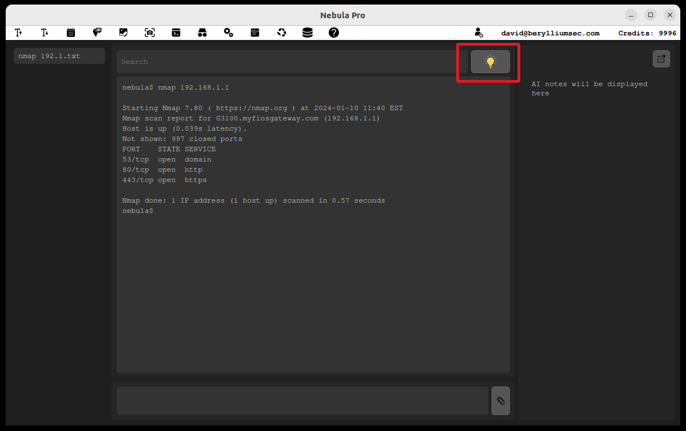
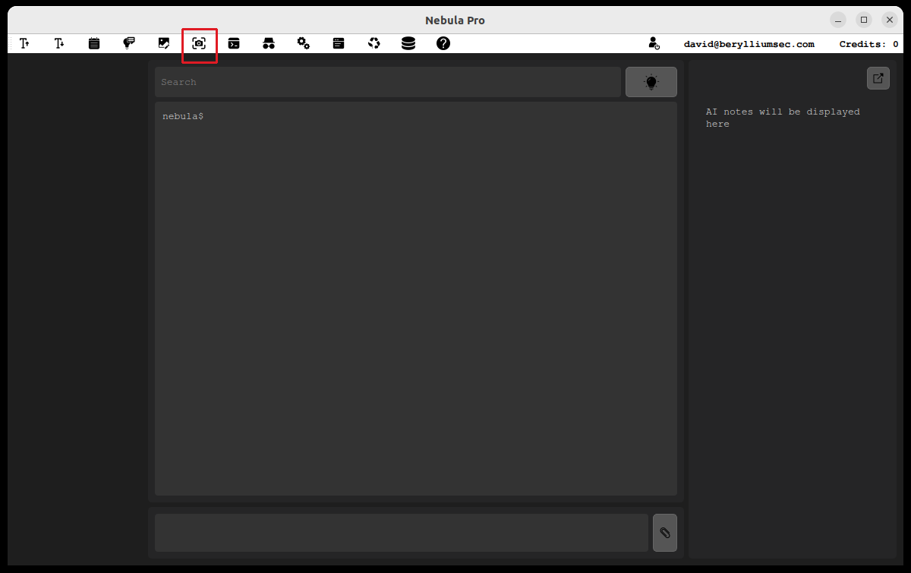
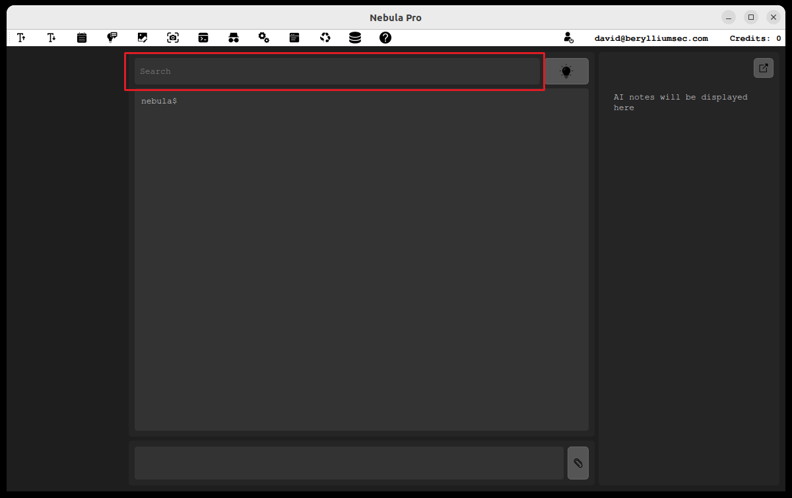
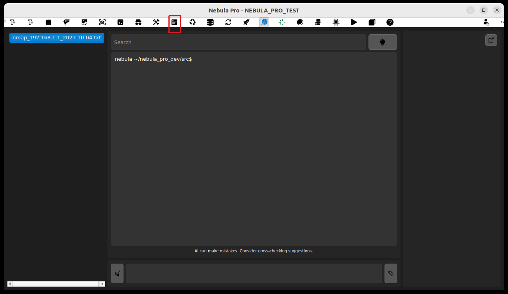
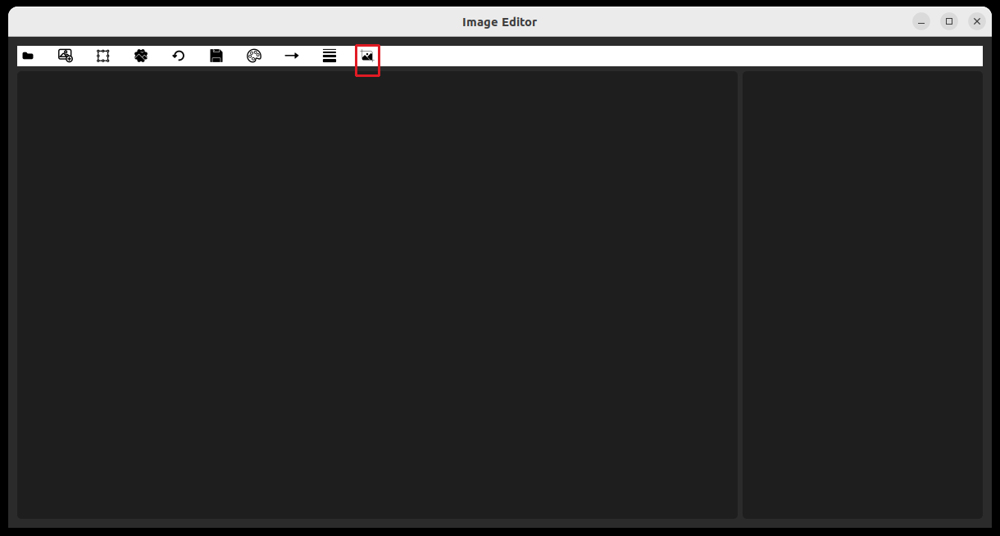
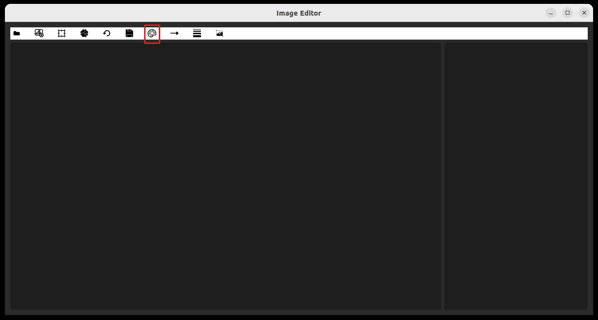
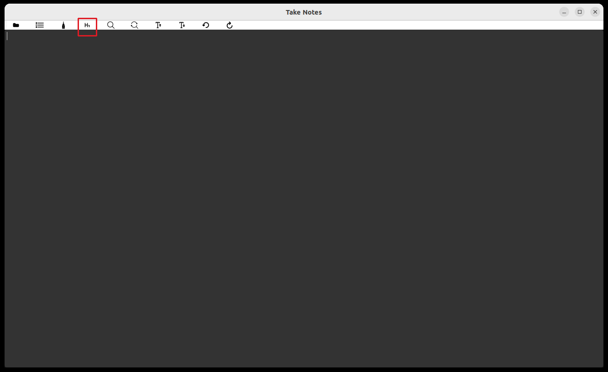
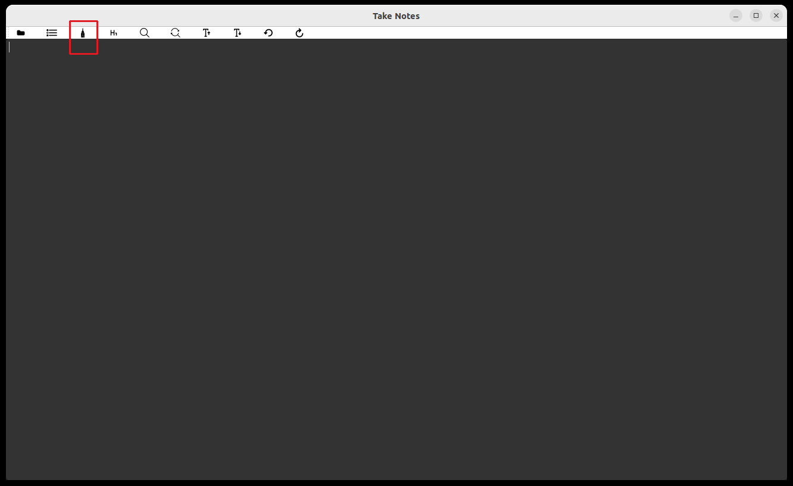
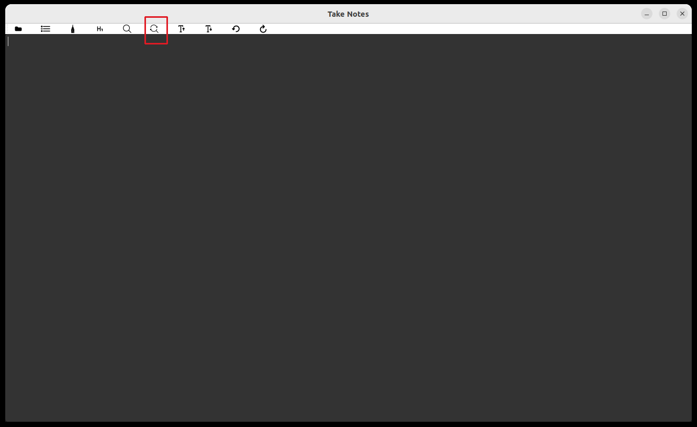
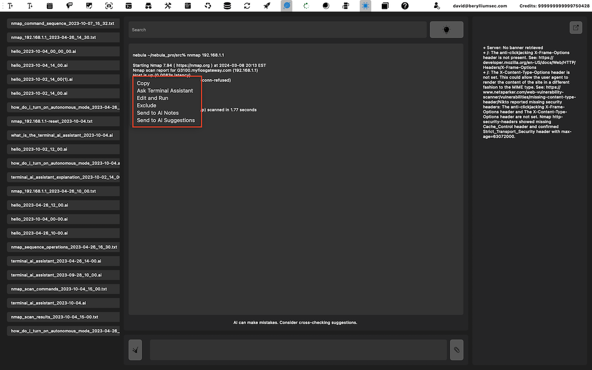

### Home Screen
- **AI-Based Note-Taking:** Toggle the icon below. You will be prompted to select your a file to store your notes in  
  

- **AI Suggestions:** Activate by toggling the icon below.  
  

- **Viewing Suggestions:** When available, the icon lights up. Click to view.  
  

- **Sending for Analysis:** Send uploaded files or previous commands for suggestions or recommendations.  
  

- **Taking Screenshots:** Click the icon below.  
  

- **Command Search:** Search and select commands, then hit enter to populate the command input area.  
  

- **Manual Note-Taking:** Click the icon below.  
  

- **Opening a New Terminal:** Click the icon below.  
  

### Image and Note Editing Features
- **Adding Images:** Click 'Add Image' and choose a file.  
  

- **Blurring Parts of an Image:** Select 'Blur', choose area, and adjust intensity.  
  

- **Cropping Images:** Select 'Crop', drag the box, and apply.  
  

- **Drawing Arrows:** Select 'Draw Arrow', choose start and end points.  
  

- **Drawing Text:** Select 'The text icons', choose start and end points.  
  
  Select 'Draw Text', click an area in the image to start typing. You can use backspace to undo text, note that once you click out of typed text, to undo you would need to click the undo button or CTRL + Z
- **Saving Changes:** Click 'Save' frequently to avoid data loss.  
  

- **Selecting Colors:** Use 'Select Color' to choose from the palette.  
  

- **Adjusting Thickness:** Use 'Thickness' to choose the level.  
  

- **Adding Headings:** Select 'Heading' and type your text.  
  

- **Highlighting:** Use 'Highlight' to emphasize areas.  
  

- **Replacing Content:** Use 'Replace' for content modification.  
  

- **Text Searching:** Use 'Search' to find specific text.  
  

- **Undoing Actions:** Click 'Undo' to revert the last action.  
  

- **Redoing Actions:** Click 'Redo' to reapply an undone action.  
  

### Settings and Customization
- **Accessing Settings:** Click the settings icon below.  
  

### Context Menu
- Interact with any text for AI-based note taking or vulnerability exploitation suggestions.  
  