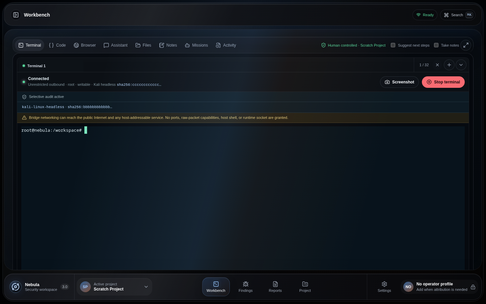

# Acknowledgement

First i would like to thank the All-Mighty God who is the source of all knowledge, without Him, this would not be possible.

# Nebula – Security Testing Workbench

Nebula is an operator first, AI powered penetration testing platform that seeks to simplify the process of network penetration testing by integrating AI Agents, Terminals, a code editor, a web browser, screenshots, note-taking, screenshots in one desktop application. 

At its core it is driven by the human operator and assisted by AI agents.



*Nebula 3.0 Zero Layer Workbench — a human-controlled security workspace with
contained terminal access, evidence tools, reporting, and supervised automation.*

## Release status

Nebula 3 is in preview. A build is available only when a `nebula-v3.*` entry and
its native artifacts appear on the
[GitHub Releases page](https://github.com/BerylliumSec/nebula/releases). If no
Nebula 3 entry is listed, no Nebula 3 installer has been published yet; use a
source checkout instead. Do not use `pip install nebula-ai` to install Nebula 3.

Preview builds are intended for evaluation on authorized systems. Back up
engagement data, review the release notes and checksums, and do not treat an
alpha build as a stable production release. The current release candidate is
[Nebula 3.0.0-alpha.5](docs/releases/3.0.0-alpha.5.md).

## Install and launch

Published releases can contain:

- a Linux x86_64 AppImage with direct updates; and
- a Linux x86_64 DEB for managed installations.

macOS, Windows, and Linux arm64 installers are not part of the current release
matrix. Docker or Podman must be installed separately for terminal and
automation features; a model provider is optional.

Download the desired asset and `SHA256SUMS-linux-x64.txt` from the
[GitHub Releases page](https://github.com/BerylliumSec/nebula/releases). Verify
the downloaded file before installing it:

```console
sha256sum --check --ignore-missing SHA256SUMS-linux-x64.txt
```

### Install the DEB

On Debian, Ubuntu, Kali, or another compatible Debian-based system, install the
managed package and its dependencies with APT:

```console
sudo apt install ./Nebula-3.0.0-alpha.5-linux-x86_64.deb
nebula
```

The DEB installs `nebula`, `nebula-ui`, and `nebula-core` system-wide and leaves
updates under administrator control.

### Run the AppImage

The direct AppImage does not require system-wide installation:

```console
chmod +x Nebula-3.0.0-alpha.5-linux-x86_64.AppImage
./Nebula-3.0.0-alpha.5-linux-x86_64.AppImage
```

The AppImage uses Nebula's signed direct-update channel. After installing the
DEB, launch the native desktop from the application menu or run:

```console
nebula
```

Administration and diagnostics use the bundled Core command:

```console
nebula-core doctor --json
nebula-core migrate
```

## Migrate existing Nebula 2 data

The discontinued application is not required to migrate an existing engagement.
Quit any running Nebula 2 process, preserve a backup of the engagement directory,
and import it without modifying the source:

```console
nebula-core import-2x "/path/to/nebula-2-engagement"
```

Verify the imported Project and its evidence before deleting the original data.
See [Migrating from Nebula 2](docs/MIGRATING-2-TO-3.md) for the integrity,
external-knowledge, verification, and recovery procedures.

## Run Nebula 3 directly from source

You do not need the DEB or AppImage to launch Nebula 3. Install Python
3.11-3.13, Poetry 2.1.3, Node.js 20 with npm, the stable Rust toolchain, and the
[Tauri prerequisites for your operating system](https://v2.tauri.app/start/prerequisites/).
Then clone the repository, install its locked dependencies, and start the native
desktop in development mode:

```console
git clone https://github.com/BerylliumSec/nebula.git
cd nebula
poetry install --with dev
npm --prefix ui ci
npm --prefix ui run tauri -- dev
```

The final command builds the local Nebula Core sidecar, starts the UI development
server, and opens the Nebula 3 desktop application. It runs entirely from the
checkout and does not install Nebula system-wide.

For browser-only development, build the workspace and let Core choose an
available loopback port:

```console
npm --prefix ui run build
poetry run nebula-core ui
```

Run the principal pre-merge checks with:

```console
python scripts/nebula3_version.py check
poetry run pytest -q tests/v3
npm --prefix ui test
npm --prefix ui run build
```

The Poetry package provides Nebula Core to the source build; it is not a separate
Nebula desktop installer.

## Documentation

- [Nebula 3 guide](docs/NEBULA3.md)
- [Nebula 3.0.0-alpha.5 release notes](docs/releases/3.0.0-alpha.5.md)
- [Automation runtime](docs/AUTOMATION-RUNTIME.md)
- [Local diagnostics](docs/NEBULA3_DIAGNOSTICS.md)
- [Usage scenarios](docs/NEBULA3_USAGE_SCENARIOS.md)
- [Release process](packaging/RELEASING.md)

Use Nebula only on systems and networks you own or are explicitly authorized to
test.
