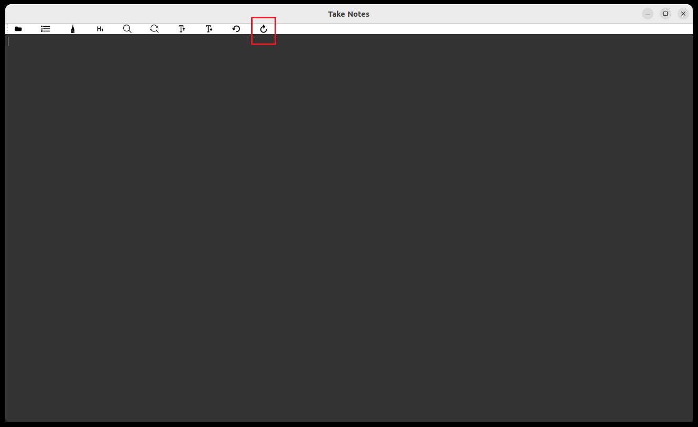

#Nebula

Welcome to Nebula


## Acknowledgement

**First i would like to thank the All-Mighty God who is the source of all knowledge, without Him, this would not be possible.**

## News

Introducing the Deep Application Profiler (DAP). DAP uses neural networks to analyze an executable's internal structure and intent, rather than relying on traditional virus signatures. This approach enables it to detect new, zero-day malware that conventional methods often miss. DAP also provides detailed breakdowns for rapid analyst review and is available as both a web service and an API. [Learn More Here](https://www.berylliumsec.com/dap-overview)


Introducing Nebula Pro, Nebula Pro improves on Nebula 2.0 by adding additional features such as autonomous mode, code analysis and more. [Learn More Here](https://www.berylliumsec.com/nebula-pro-overview)

## Nebula: AI-Driven Penetration Testing Platform

Nebula is a cutting-edge toolkit designed for penetration testers. It integrates AI Models right into the command line interface and supports any tool that can be invoked from the CLI


## Installation

## System Requirements

- At least 8GB of GPU memory, we tested with 12GB
- Python >= 3.11

```bash
python -m pip install nebula-ai --upgrade
```

## Running Nebula

**important**

The first time you run Nebula, it will ask you to select a cache dir. The cache dir is where it will download the Model that you choose. For the models, you will need to create a free [Hugging Face Account](https://huggingface.co/), agree to the terms, generate an access token and export it to your CLI like so:


```bash
export HF_TOKEN=Your Token
```

This step only needs to be completed once. Monitor the command line interface where you invoked `nebula` from to monitor the download progress.

## Key Features

### Interacting with the models. 

To interact with the models, begin your input with a `!` for example: `! write a python script to scan the ports of a remote system`

### AI-Assisted Note-Taking
Automatically records pivotal security findings, categorizes them with CWE-IDs, and aligns them with NIST controls when applicable.

### Real-Time AI-Driven Insights
Provides immediate suggestions for discovering and exploiting vulnerabilities, based on outputs from integrated terminal tools.

### Enhanced Tool Integration
Seamlessly import data from external tools to capitalize on AI-powered note-taking and receive instant advice.

### Integrated Screenshot and Editing
Facilitates capturing and editing images within the toolkit for streamlined documentation.

### Manual Note-Taking
Offers a dedicated space for user-driven documentation, complementing the AI's automated notes. (Notes are auto-saved)

### Automatic Command Logging
Keeps a record of all commands executed within the terminal for easy reference and analysis.

## Getting Started

### Intuitive User Interface
Designed for ease of use, with tooltips for quick guidance and icons that intuitively represent their functions.

## User Guide

For a comprehensive video guide visit [here](https://www.berylliumsec.com/nebula-pro-feature-guide) and [here](https://www.youtube.com/playlist?list=PLySxaLbLL0gpAaDQYq6g6sb1q6KwqOAr4). Please note that some features are only applicable to Nebula Pro
### Home Screen
- **AI-Based Note-Taking:** Toggle the icon below. You will be prompted to select your a file to store your notes in  
  

- **AI Suggestions:** Activate by toggling the icon below.  
  

- **Viewing Suggestions:** When available, the icon lights up. Click to view.  
  

- **Sending for Analysis:** Send uploaded files or previous commands for suggestions or recommendations.  
  

- **Taking Screenshots:** Click the icon below.  
  

- **Command Search:** Search and select commands, then hit enter to populate the command input area.  
  

- **Manual Note-Taking:** Click the icon below.  
  

- **Opening a New Terminal:** Click the icon below.  
  

### Image and Note Editing Features
- **Adding Images:** Click 'Add Image' and choose a file.  
  

- **Blurring Parts of an Image:** Select 'Blur', choose area, and adjust intensity.  
  

- **Cropping Images:** Select 'Crop', drag the box, and apply.  
  

- **Drawing Arrows:** Select 'Draw Arrow', choose start and end points.  
  

- **Drawing Text:** Select 'The text icons', choose start and end points.  
  
  Select 'Draw Text', click an area in the image to start typing. You can use backspace to undo text, note that once you click out of typed text, to undo you would need to click the undo button or CTRL + Z
- **Saving Changes:** Click 'Save' frequently to avoid data loss.  
  

- **Selecting Colors:** Use 'Select Color' to choose from the palette.  
  

- **Adjusting Thickness:** Use 'Thickness' to choose the level.  
  

- **Adding Headings:** Select 'Heading' and type your text.  
  

- **Highlighting:** Use 'Highlight' to emphasize areas.  
  

- **Replacing Content:** Use 'Replace' for content modification.  
  

- **Text Searching:** Use 'Search' to find specific text.  
  

- **Undoing Actions:** Click 'Undo' to revert the last action.  
  

- **Redoing Actions:** Click 'Redo' to reapply an undone action.  
  

### Settings and Customization
- **Accessing Settings:** Click the settings icon below.  
  


### Context Menu
- Interact with any text for AI-based note taking or vulnerability exploitation suggestions.  
  


### Roadmap

- Support more models


### Troubleshooting

Logs are located at `/home/[your_username]/.local/share/nebula/logs`. You would most likely find the reason for the error in one fo those logs

### Get more support

Please open an Issue
---
