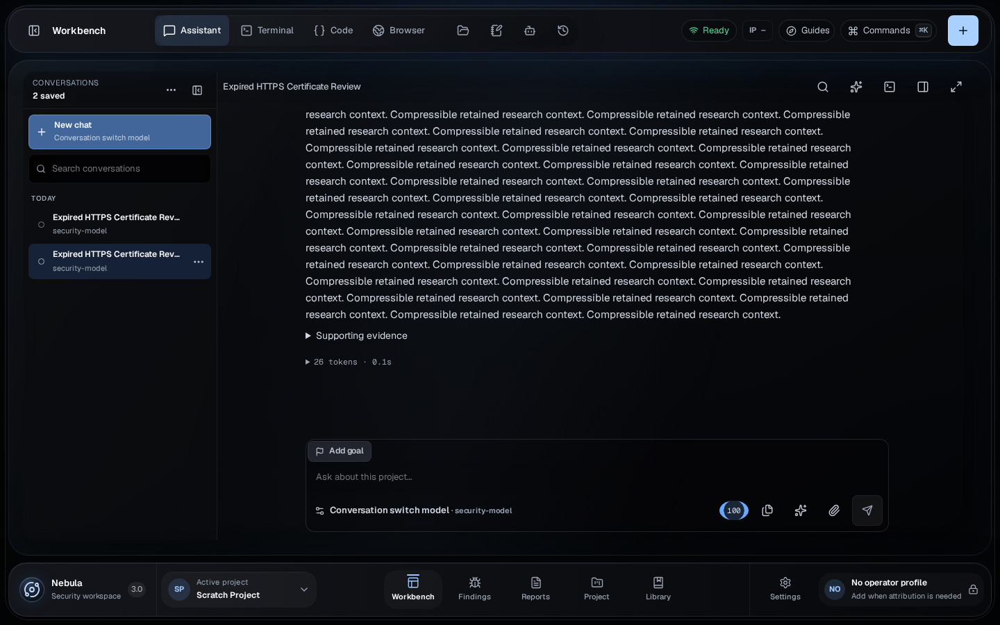

# Chat-switch performance quality contract

## Operator journey

From Workbench Chat, the operator selects a saved conversation and can read its
cached or cold transcript while Nebula reconciles the authoritative Core history
and actionable turn state. Switching again, refreshing, or reconnecting must
never apply an older conversation's response to the selected URL.

## State authorities and invariants

| State | Authority | Observable invariant |
| --- | --- | --- |
| Selected conversation | URL, reconciled with the selected row | The URL, highlighted row, title, transcript, and composer all identify the same conversation. |
| Durable transcript and turn state | Core database | Cached content is presentation-only; Core replaces it after refresh. Pending approvals, failures, and recovery actions remain visible. |
| Cached preview and reading position | React memory | A recent A-to-B-to-A switch restores readable messages and scroll position before a held refresh completes. |
| Draft | Device-local React/browser state | An unsent draft survives switching away and back without moving to another conversation. |
| Connection lifecycle | Core plus provider or harness stream | Switching detaches the viewer from the old stream without cancelling Core work or accepting stale events. |

## Lifecycle coverage

| Journey step | Requirement | Test layer |
| --- | --- | --- |
| Discover | Saved conversations remain visible in the conversation list. | Mock Playwright |
| Select/use | Cached and cold selections commit identity immediately and reconcile durable history. | Component, mock Playwright, real Core |
| Stream/interrupt | Switching detaches the old viewer; pending work and recovery state restore on return. | Mock Playwright, real Core |
| Background/reconnect/refresh | Durable transcript, active identity, and reading position return without duplication. | Mock Playwright, real Core |
| Failure/retry | History failure clears unsafe presentation; action-state failure preserves readable history but disables mutations until retry. | Component, mock Playwright |
| Fork/delete/revoke | Not changed by this tranche; existing behavior remains covered by its focused journeys. | Existing focused tests |

## Performance and verification boundaries

- Session-scoped reads use an indexed projection while entity JSON remains the
  durable source of truth.
- Blocking storage reads cannot hold the ASGI event loop and delay unrelated
  chat state or queue requests.
- Large non-streaming responses may be compressed; event streams must not be.
- Collapsed reasoning is not parsed or mounted until the operator expands it.
- Full transcript virtualization, pagination, polling replacement, worker-count
  changes, and database PRAGMA tuning are explicitly out of scope.
- Verification is limited to focused unit/component tests, the nine permanent
  `conversation-switch-performance` Playwright entries, a production build, and
  the real-Core LAN journey. Full suites are excluded.

## Acceptance evidence — 2026-09-23

- Storage/API selection: 23 focused Python cases were selected; 22 passed
  locally and the PostgreSQL case was skipped because no local PostgreSQL test
  URL was available. Coverage
  includes migration upgrade/backfill/downgrade, projection create/update/import/
  reservation paths, ordering and replaced-message behavior, SQLite index-plan
  use, ASGI threadpool isolation, compression, pre-encoded/SSE exclusions, and
  non-sensitive timing headers. PostgreSQL execution remains conditional on
  `NEBULA_TEST_POSTGRES_URL` and was unavailable locally.
- Rendering: eight focused component cases passed for preview caching, collapsed
  and streaming reasoning, and per-message grouping. The production UI build
  passed with build time `2026-09-23T16:18:23.401Z`; existing dynamic-import and
  chunk-size warnings remain.
- Browser matrix: the exact conversation-switch journey passed in all eight
  selected mock profiles: desktop 1440x900, compact 1024x700, Chromium
  320/390/430, and WebKit 320/390/430. It exercises cold and cached switches,
  independently delayed history/action state, A-to-B-to-A cancellation, URL and
  transcript agreement, draft/scroll restoration, failure/retry, lazy reasoning,
  keyboard/touch, axe analysis, and horizontal overflow.
- Real Core: `assistant-real-desktop` passed in 16.5 seconds against the
  production bundle at non-loopback origin `http://192.168.1.155:42541`. Five
  concurrent large-history/state samples measured history at 20-28 ms and state
  at 16-27 ms; every history response was gzip encoded and carried an
  `app;dur=...` timing header. Browser preview and authoritative measures were
  15.3 ms and 365.6 ms. The journey retained a screenshot and JSON attachment
  under its Playwright test result.
- Database benchmark: a migrated temporary copy of the current 88,065-entity
  SQLite database was measured for five connection-open runs against a session
  with 127 messages. The JSON-predicate baseline was
  50.549/51.265/54.999/63.376/68.876 ms (54.999 ms median); the covering-index
  lookup was 0.132/0.076/0.097/0.080/0.090 ms (0.090 ms median), a 99.8% median
  reduction. `EXPLAIN QUERY PLAN` selected
  `ix_entities_kind_chat_session_created` without a temporary ordering B-tree.
- Physical-phone verification is unavailable in this environment. The pull
  request must therefore remain a draft, and no physical-device or software-
  keyboard support claim is made. No full suite was run.

