# Assistant context state machines

This is the source-controlled counterpart to the
[Action states page in Figma](https://www.figma.com/design/tVEa0PXZaa7H4ZLflwgcb7?node-id=4-19).
The [context lifecycle guide](../CHAT_CONTEXT_LIFECYCLE.md) explains the
authorities and limits behind these transitions. These diagrams describe
provider-backed chat on `main` as of 2026-09-26; harness-managed calls have a
separate runtime owner.

## Conversation request

```mermaid
stateDiagram-v2
    [*] --> Stored: user message arrives
    Stored --> Rebuilt: merge active canonical transcript
    Rebuilt --> Direct: estimated input <= target
    Rebuilt --> Compact: estimated input > 75% input capacity
    Compact --> Reuse: ready snapshot covers exact sources and tail fits
    Compact --> Summarize: new or changed archived sources
    Summarize --> Ready: validated sourced memory
    Summarize --> Failed: model, validation, or budget error
    Compact --> Failed: mandatory input cannot fit
    Reuse --> Request
    Ready --> Request: memory + recent user-led tail + optional originals
    Direct --> Request: active messages + instructions
    Failed --> [*]: actionable error; originals retained
    Request --> Stored: answer saved as canonical message
```

`Stored` is durable; `Request` is a temporary projection. A new user turn
rebuilds from saved messages. Previous turn tool calls are not appended to that
new request as a raw transcript. A snapshot is derived and must cite its
covered canonical messages. Pending approvals/recovery block a new user turn
before this diagram begins.

## Continuing one provider turn

```mermaid
stateDiagram-v2
    [*] --> ToolStep: tool completes or fails
    ToolStep --> Ledger: append step event; retain output/artifact
    Ledger --> Replay: reconstruct latest step projection
    Replay --> Recent: retain latest 8 response groups in full
    Recent --> Checkpoint: 16 eligible steps or 24k estimated tokens or over target
    Recent --> Fit: checkpoint does not advance
    Checkpoint --> Fit: fold older nonwaiting steps into bounded receipts
    Fit --> Clear: request still over target
    Fit --> Send: request fits
    Clear --> Send: replace oldest full outputs with receipts
    Send --> ToolStep: model requests another tool
    Send --> [*]: model completes answer
```

The checkpoint has a 16 KiB byte cap and can omit individual receipts while
recording their covered ranges/count and an `omitted_steps` count. Clearing
keeps result identity and available artifact references. Neither operation
deletes the durable ledger. Waiting approvals/callbacks remain outside the
checkpoint. The newest result stays whole when hard capacity allows.

## Operator-visible states and recovery

| State | Authority and visible meaning | Valid next action |
| --- | --- | --- |
| `not_needed` | Core estimates saved conversation below the target; no snapshot required | Continue |
| `stale` | Active estimate needs compaction or an existing snapshot no longer fits | Send/continue and let Core reassemble; inspect limits if it fails |
| `ready` | A sourced snapshot is available for the active projection | Inspect saved memory or original transcript; continue |
| `failed` | Latest required compaction failed; original messages remain | Retry after resolving model, budget, or capacity error |
| `runtime_managed` | External harness owns context and Core has no authoritative capacity | Inspect harness activity |
| pending approval/recovery | Durable turn or uncertain effect, outside lossy memory | Resolve the decision/effect before starting another turn |

The UI meter estimates saved messages and project instructions; it excludes
some request-time additions. It does not display the complete historical
transcript size or prove what a prior provider call received. Use the saved
request estimate and canonical records for a historical investigation.
