# Assistant context state machines

This is the source-controlled counterpart to the
[Action states page in Figma](https://www.figma.com/design/tVEa0PXZaa7H4ZLflwgcb7?node-id=4-19).
The [context lifecycle guide](../CHAT_CONTEXT_LIFECYCLE.md) explains the
authorities and limits behind these transitions. These diagrams describe
provider-backed chat on `main` as of 2026-09-26; harness-managed calls have a
separate runtime owner.

## Conversation request

```mermaid
stateDiagram-v2
    [*] --> Stored: user message arrives
    Stored --> Rebuilt: merge active canonical transcript
    Rebuilt --> Direct: calibrated estimate incl. tool reserve <= target
    Rebuilt --> Compact: calibrated estimate incl. tool reserve > target
    Compact --> Reuse: latest ready snapshot matches covered ids and content hash
    Compact --> Summarize: new, changed, or outgrown archive
    Compact --> Failed: current message and mandatory input exceed capacity
    Reuse --> Request: everything after its boundary fits
    Reuse --> Summarize: rest no longer fits beside its memory
    Summarize --> Ready: validated memory (invalid items dropped; reused leaf segments)
    Summarize --> Ready: model or validation failure gives a degraded extract
    Summarize --> Failed: budget error or compaction cannot fit
    Ready --> Request: fits target
    Ready --> Summarize: over target without excerpts; boundary moves forward (max 3)
    Ready --> Request: still over target, within input capacity
    Ready --> Failed: above input capacity
    Direct --> Request: active messages + instructions
    Failed --> [*]: actionable error; originals retained
    Request --> Stored: answer saved as canonical message
    Stored --> Precompact: answer saved and estimate >= 60% of target (background)
    Precompact --> Ready: snapshot for the boundary the crossing turn would choose
    Precompact --> Stored: below threshold, snapshot still serves, or failed (next turn compacts)
    Compact --> Precompact: no snapshot serves and a background compaction is running; the turn waits for it
```

`Stored` is durable; `Request` is a temporary projection. A new user turn
rebuilds from saved messages. Previous turn tool calls are not appended to that
new request as a raw transcript; each saved answer carries a bounded,
deterministic tool-activity block with the ids that read its tools' output
again, and the conversation's working notes follow the new operator message
and any retrieved originals. A snapshot is derived and must cite its covered
canonical messages. In `Request`, the memory leads the first message kept
verbatim; the turn's retrieved operator help and project knowledge, then
retrieved originals, follow the current message's own text; the
instructions carry none of them. No canonical message is left out: moving the
boundary compacts the messages it passes rather than dropping them. Pending
approvals/recovery block a new user turn before this diagram begins.
`Precompact` runs in the background after a saved answer, never inside a
turn. Its snapshot waits until a turn crosses the target and reuses it; a turn
that needs one while it runs waits for it, and one that arrives before it
starts cancels it and compacts for itself.

## Continuing one provider turn

```mermaid
stateDiagram-v2
    [*] --> ToolStep: tool completes or fails
    ToolStep --> Ledger: append step event; retain output/artifact
    Ledger --> Replay: reconstruct latest step projection
    Replay --> Recent: retain latest 8 response groups in full
    Recent --> Checkpoint: 16 eligible steps or 24k estimated tokens
    Recent --> Fit: checkpoint does not advance
    Checkpoint --> Fit: fold older nonwaiting steps into bounded receipts + notes
    Fit --> Sticky: replay results already cleared this turn as receipts
    Sticky --> Send: request fits target
    Sticky --> Cross: request crosses target
    Cross --> Clear: advance checkpoint; still above watermark
    Cross --> Send: advance reaches watermark
    Clear --> Send: clear oldest whole outputs, then earlier reasoning, down to watermark
    Clear --> Compact: still over input capacity
    Compact --> Sticky: conversation compacted; replay unchanged
    Compact --> Fold: nothing smaller
    Fold --> Sticky: all but the newest step folded into the checkpoint
    Fold --> Answer: nothing left to fold (routing stops)
    Send --> Compact: provider rejects; clearing cannot fix it
    Send --> ToolStep: model requests another tool
    Send --> Answer: model finishes routing
    Answer --> [*]: synthesis fits (help dropped, conversation compacted, steps folded)
    Answer --> [*]: actionable capacity error; tool results saved
```

Receipts say what each step acted on and how it ended. Their byte bound is 3%
of input capacity, between 16 KiB and 64 KiB; over it, individual receipts are
omitted while their covered ranges/count and an `omitted_steps` count remain.
A checkpoint also carries the conversation's latest working notes. Clearing
keeps result identity and available artifact references, and a cleared result
stays cleared for the rest of the turn, so earlier request bytes change once
per target crossing. Neither operation deletes the durable ledger. Waiting
approvals/callbacks remain outside the checkpoint. The newest result stays
whole when hard capacity allows. When even a fully cleared history leaves the
request over capacity, or the provider refuses a request clearing cannot fix,
the conversation ahead of the history is compacted mid-turn (once per step and
cause). The ledger replay is sent unchanged, no tool runs again, and the
compacted conversation serves the rest of the turn. When the replayed steps
are what no longer fit, all but the newest fold into the checkpoint. Lookups
the model made this turn are cleared after its other results.

## Operator-visible states and recovery

| State | Authority and visible meaning | Valid next action |
| --- | --- | --- |
| `not_needed` | Core estimates saved conversation below the target; it is sent whole, so no snapshot is reported even if one was prepared in the background | Continue |
| `stale` | Active estimate needs compaction or an existing snapshot no longer fits | Send/continue and let Core reassemble; inspect limits if it fails |
| `ready` | A sourced snapshot is available for the active projection; `quality` says whether it is complete, salvaged, or a degraded extract | Inspect saved memory or original transcript; continue |
| `failed` | Latest required compaction failed on budget or capacity; original messages remain | Retry after resolving the budget or capacity error |
| `runtime_managed` | External harness owns context and Core has no authoritative capacity | Inspect harness activity |
| pending approval/recovery | Durable turn or uncertain effect, outside lossy memory | Resolve the decision/effect before starting another turn |

The UI meter estimates saved messages, project instructions, and the latest
turn's tool definitions and routing instructions, scaled by the conversation's
calibration from provider-reported usage. It excludes goal, skill and decision
instructions and per-turn retrieved material. It does not display the complete
historical transcript size or prove what a prior provider call received. Use
the saved request estimate and canonical records for a historical
investigation.
