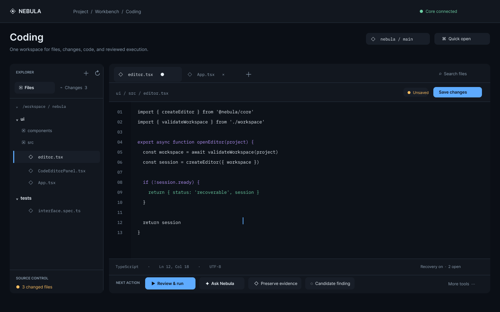
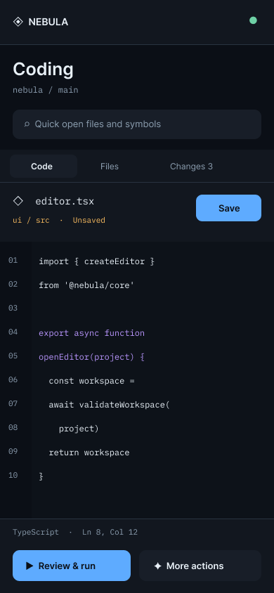

# Coding workbench makeover

Figma: [Desktop and mobile concepts](https://www.figma.com/design/TPqOrynXyTliiZbALE0mRZ)

This is a design proposal for **Project → Workbench → Coding**. The branch contains review notes and exported concept images; it does not change the running UI.

## Review

The existing Coding panel has substantial capability: file navigation, source control, multiple buffers, split editing, language intelligence, task execution, assistant handoff, and evidence preservation. Its main weakness is hierarchy. A long horizontal toolbar holds many unlike actions, while Python intelligence sits in another strip and security workflow actions sit in the footer. The primary file context and save state compete with these controls. On mobile, files and tools become separate toggles, making the available workflow less legible.

## Proposed operator journey

Open Coding from the project Workbench; use Quick open or the Explorer to select a file; edit in a stable code canvas; see the file's unsaved or conflict state beside Save; then choose a reviewed next action from the bottom rail. Files and Changes share the explorer. Secondary commands such as format, rename, split, settings, and environment live in More tools. On mobile, Code, Files, and Changes become explicit views, while Save and the next action remain visible.

The desktop concept uses the current dark Nebula language with quieter chrome, larger code space, a stronger active-file cue, and one contextual action row. The mobile concept uses a 390 px viewport and gives file navigation its own view instead of compressing the desktop explorer beside the editor.

## State and quality contract for implementation

Core and the linked workspace remain authoritative for file bytes and source-control state. React buffer state owns an unsaved draft; durable editor recovery owns restored tabs and drafts; the URL owns the active project/workbench route; device preferences own local editor settings. A saved status appears only after the server confirms exact bytes. External edits or deletions must keep the draft visible and expose Reload, Keep as draft, or explicit overwrite without hiding the conflict in More tools.

Applicable lifecycle: discover, open, create, edit, save, refresh, conflict, retry, restore, reconnect, close, and handoff. The proposed layout must preserve keyboard shortcuts and focus, 44 px touch targets, accessible icon labels, reduced motion, 320–430 px behavior, desktop split editing, and the existing reviewed execution and evidence boundaries.

Implementation should use focused component checks plus selected desktop Chromium, mobile Chromium, mobile WebKit, real-Core, production-bundle, and LAN-origin journeys under the repository test-selection procedure. No implementation or runtime verification is claimed by these concept images.

