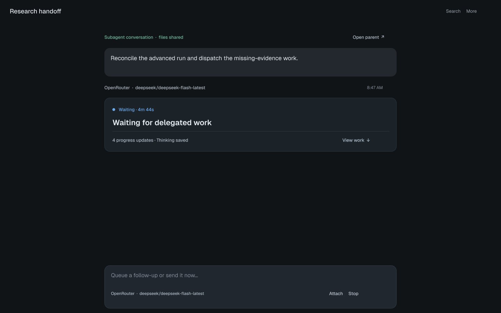
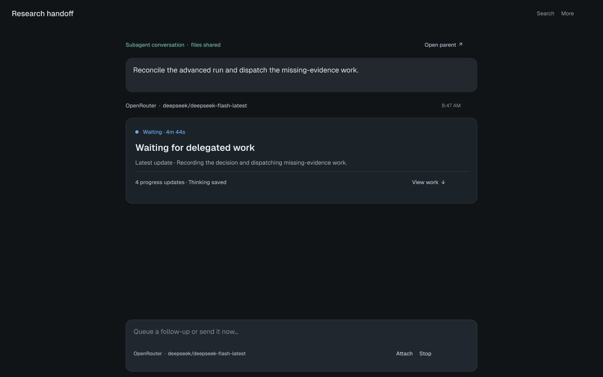
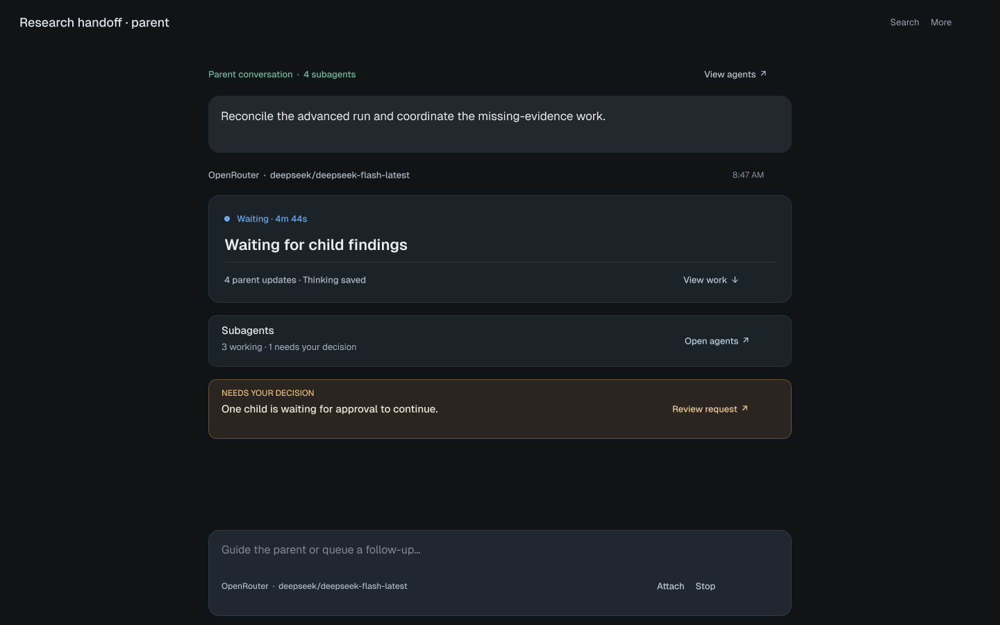

# Interim assistant content: conversation mockups

Status: option B selected and implemented on 2026-09-25. All names, elapsed times, counts, and child states in the mockups are illustrative.

## Why the current screen is still noisy

The screenshot's four process paragraphs are the in-progress assistant turn's `content` in Core's `chat_turns` record. The turn was in `waiting_callback` when inspected. `ChatTranscriptRow` renders `message.content` as full assistant Markdown before its compact `ActivityLedger`; the previous cleanup grouped structured commentary and activity, but it did not change this in-progress content path. The separate “Thinking…” disclosure adds another row above it.

This means the design decision is about **how to present a nonterminal assistant content stream**, not merely about spacing or font size. The source text must remain available, and a completed answer must appear in full.

## Alternatives

| Option | Default while running or waiting | Advantage | Cost |
| --- | --- | --- | --- |
| **A · Status only** | One state line and concise current-work label. Interim content and thinking live behind **View work**. | Strongest separation between progress and answer; one scan shows whether to wait or act. | A useful interim sentence takes one click to read. |
| **B · Latest update** | Same state line plus one explicitly labeled, short preview of the newest update. Earlier text and thinking live behind **View work**. | More context without opening work history. | The preview can still read like an answer, especially when a provider writes long narration. |

Selected direction: **B** for provider turns with nonterminal content. The latest text update remains visible as a short, explicitly labeled preview; all saved text remains available in **View work**. Show requests for approval, input, failure, or retry outside the disclosure. When the turn completes, show the final answer in the transcript and keep prior process text behind **View work**. A failed or cancelled turn keeps its partial content directly reachable with the existing error or stopped status. Harness final-answer streaming keeps its existing presentation because harness commentary already has a separate activity channel.

Operator wording: show **Waiting for delegated work** for a paused parent and **Collect delegated reports** for the activity entry. `wait_subagents` remains the tool's internal capability name. When the work card already carries a subagent wait, omit the duplicate status strip below the transcript; retain the command callback strip and its results URL.

### Figma and local previews

| View | Figma | Preview |
| --- | --- | --- |
| A · Subagent, status only | [Figma frame](https://www.figma.com/design/3UzfLAS0vL7gZKBvAesXVF?node-id=12-2) |  |
| B · Subagent, latest update | [Figma frame](https://www.figma.com/design/3UzfLAS0vL7gZKBvAesXVF?node-id=12-32) |  |
| A · Parent, child state and action | [Figma frame](https://www.figma.com/design/3UzfLAS0vL7gZKBvAesXVF?node-id=12-62) |  |

The frames reuse the existing Nebula mockup styling and Geist typography. Figma has no Nebula component instances, local variables, or Code Connect mappings in this file, so these are visual explorations rather than a component specification.

## Operator contract

- **Entry and authority:** Opening a parent or subagent conversation selects the URL route and reads the authoritative turn, transcript, activity, child state, and pending requests from Core. React owns only disclosure state.
- **Stream and wait:** A nonterminal turn has one visible status. Its interim content remains readable in order under **View work**. A pending callback or child wait must not look like a finished answer.
- **Action:** An approval, question, failure, or retry remains visible and actionable in the transcript. The parent shows a child request only when the decision belongs to the operator; the action opens the authoritative child interaction.
- **Complete:** The final answer is full-size content. Earlier process updates remain available without preceding or visually outweighing the answer.
- **Replay:** Refresh, reconnect, and historical replay reconstruct the same state and work history without duplicate paragraphs or lost actions.
- **Responsive:** The status, disclosure, action, and composer remain reachable by keyboard and touch at 320–430 px. A selected direction still needs a mobile mockup and real workflow validation before implementation can be called complete.

## Implementation acceptance plan

| Journey step | Observable invariant | State authority | Planned test layer |
| --- | --- | --- | --- |
| Open parent or subagent | One selected conversation, correct parent link, and no duplicate progress paragraphs | URL and Core session/turn | Existing component and browser entry |
| Stream or wait | The newest provider update is labeled; earlier exact content and thinking open under **View work** | Core turn content and wait state | Pure helper plus desktop/mobile browser |
| Require action | Approval, input, or failure is visible without opening work history | Core pending request/error | Focused browser cases |
| Complete | Final answer leads; saved routing prose remains available and copyable as work history | Core saved message plus prefix boundary | Core test plus browser reload |
| Refresh or reconnect | Latest preview and saved history reconstruct without duplication | Core transcript and turn | Real-Core browser case |
| Stop or retry | Partial output and the existing stop/error status remain visible; the retry path stays usable | Core turn outcome | Existing focused browser case |

No data migration is planned. Existing saved messages without a routing-prefix boundary retain their current full text; the boundary is recorded for newly completed provider turns. A live external provider and physical phone are separate acceptance evidence, not implied by fixtures or emulation.

## Questions for review

1. Is the status-only version calm enough, or do you want the single latest-update preview?
2. Should “Thinking” appear as a separate disclosure, or only inside **View work** during nonterminal turns?
3. For a waiting turn, does “Waiting for delegated work” convey enough, or should the specific child or callback source be named when Core has it?
