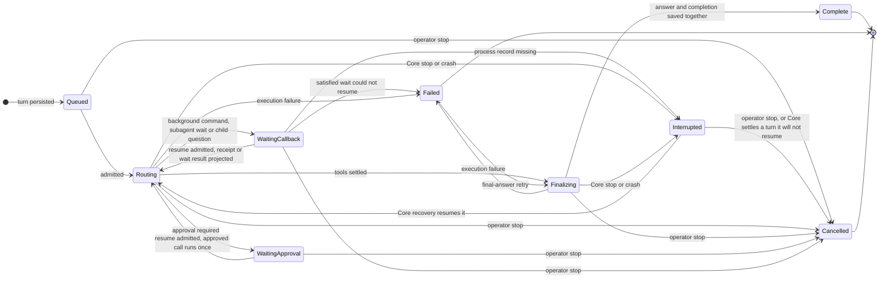
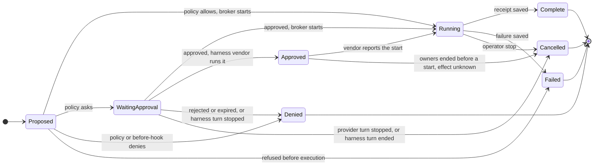
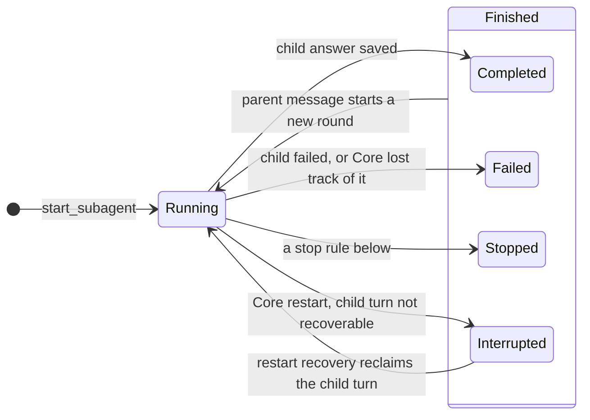
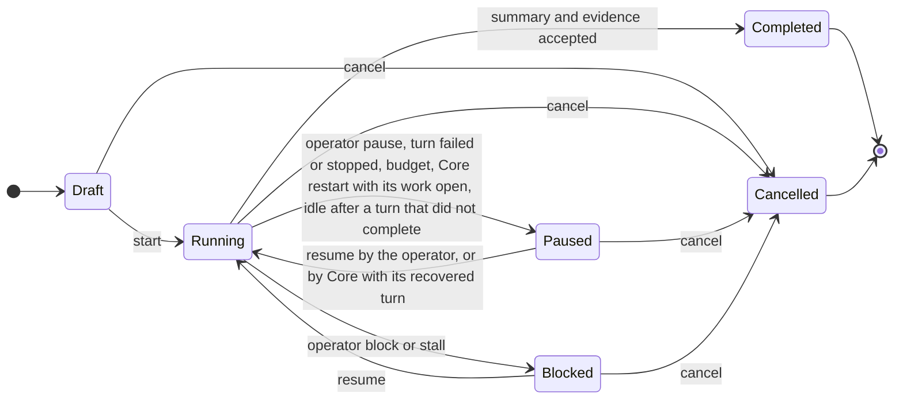
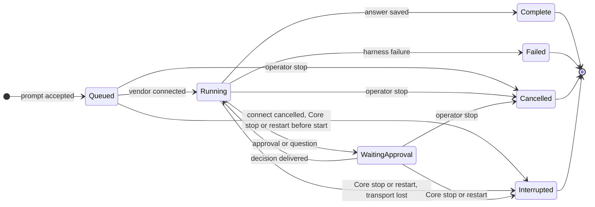
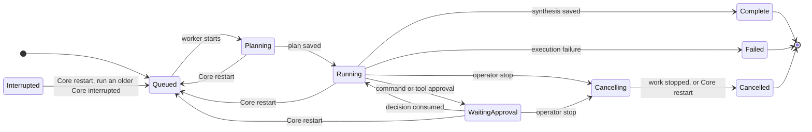

# Execution and restart recovery lifecycle

Status: implemented automatic recovery contract, updated September 24, 2026 for
`main` after the assistant lifecycle audit fixes (#563–#578). The incident and
failure inventory preserve the production behavior before September 22; the
state owners, state machines, target contract, defect closure table, and proof
matrix describe `main`. The matrix distinguishes the observed incident from
defects reproduced with fault injection.

[Editable FigJam lifecycle board](https://www.figma.com/board/aoQcmstUOUo3n11Cg8YKXf)
contains the state machines as mocked on September 22, the observed restart
race, a failure map, and the proposed recovery state machine. It predates the
September 24 changes; where the board and this document differ, this document
describes the code.

## Scope and state owners

The recovery journey starts when Core reconnects. It is system-owned: the
operator does not visit each parent, child, tool, or hook. A valid recorded
result clears only its exact invocation. An outcome that remains unknowable is
carried into supervisor history as explicit uncertainty, the original ledger
slot remains available to a late receipt, identical replay is refused, and the
execution hierarchy resumes automatically.

| Journey step | Observable invariant | State authority | Proof layer |
| --- | --- | --- | --- |
| Reconnect and select | The same conversation and interrupted response return. | URL identity and Core `ChatSession`/`ChatTurn` | Real Core browser restart |
| Admit | A new or resumed turn waits for capacity without changing how it resumes. | `provider_turn_queue` row and `ChatTurn.status` | Core scheduler tests |
| Classify effect | A terminal receipt clears only its exact invocation; an uncertain effect becomes a non-replayable observation; a result already in history is never rewritten. | `ToolCall` or `NativeHookExecution` ledger and the turn ledger | Core and API fault injection |
| Resume hierarchy | Child turn, parent wait, supervisor turn, and goal are reclaimed without an operator action. | Core turn, subagent, inbox, and goal records | Core and browser restart cases |
| Continue goal | Recovered history and provider call identity survive; graceful stop and process restart use the same automatic path; a running goal never sits idle. | Core `ChatTurn` and `ChatGoal` | Core and real Core |

The recovery notice is transient presentation state and has no decision
controls. The URL selects the session; Core owns the turn, tool, hook, goal, and
child records. Provider streams and hook processes can outlive a Core stop, so
their process state is not an effect receipt. Fork, delete, and revoke do not
change recovery ownership.

Nebula has two supervisors with different contracts. A conversation goal owns a
sequence of provider turns and can have child goals; a provider turn can delegate
to Core-owned subagents. A Mission run uses a separate planner, task graph, and
specialists. They share the tool ledger and use the same recovery rule: adopt a
valid receipt, preserve explicit uncertainty, refuse blind replay, and continue.
Harness turns (Codex, Claude, Grok) are owned by their vendor runtime; Core
settles them after a restart but never replays them.

| Entity | Durable owner | Current states | Restart action |
| --- | --- | --- | --- |
| Conversation goal | `ChatGoal` | draft, running, paused, blocked, completed, cancelled | Startup pauses a running goal whose worker held its claim or whose turn awaits restart recovery. The recovery pass resumes that goal with its turn, or settles the turn when the goal is cancelled, completed, blocked or out of time. A running goal with nothing running is continued or paused by the recovery tick. |
| Provider turn | `ChatTurn` plus its `provider_turn_queue` row | queued, routing, waiting_approval, waiting_callback, finalizing, complete, failed, cancelled, interrupted | A routing or finalizing turn is fenced and interrupted; receipts are adopted, unknowns are materialized, and Core starts it again. Queued rows (new turns and accepted resumes) are restored in the state they were queued in. Parked turns stay parked. |
| Subagent round | `ChatSubagent` plus its child `ChatTurn` | running, completed, failed, stopped, interrupted; the list API projects `recovering` while the child turn awaits restart recovery | A child whose turn Core recovers stays running; one parked on an approval or a question stays; a settled child turn is reported; any other running child becomes interrupted and is reported. Delivery and goal charging are repaired idempotently. |
| Tool call | `ToolCall` ledger | proposed, waiting_approval, approved, running, denied, cancelled, failed, complete | The ledger remains authoritative. Only a call whose result never reached provider history is uncertain; an interrupted retrieval read is rerunnable. Missing receipts create an explicit observation without rewriting the call. |
| Native hook | `NativeHookExecution` | running, complete, failed, timed_out, interrupted, reconciled | A late successful receipt is adopted. Remaining uncertainty is preserved as audit evidence and does not block the supervisor. |
| Background command | `CommandExecution` | waiting_approval, running, completed, failed, timed_out, cancelled, interrupted | A running execution becomes interrupted. Its callback wait settles as an unknown effect; a late receipt attaches to the settled call. |
| Harness turn | `HarnessTurn` plus its `ChatTurn` and `HarnessSession` | queued, running, waiting_approval, complete, failed, cancelled, interrupted | Running, waiting and still-connecting chat turns become interrupted with their chat turn; pending approvals and questions are retired. Nothing is replayed; the operator retries. |
| Mission run | `AgentRun` plus tasks/attempts/tools | queued, planning, running, waiting_approval, paused, cancelling, cancelled, failed, interrupted, complete | Core queues the last checkpoint under a new recovery generation, replays each recorded routing response, preserves ambiguous tool rows, and resumes under the normal concurrency limit. A cancelling run is finalized cancelled. |

The browser projects `recovering` while Core will resume an interrupted turn
and `needs_stop` when it will not; it never asks for effect classification or a
Resume click. Stop stays available and is the exit from `needs_stop`. Normal
approvals remain decisions because they were already required by policy;
restart uncertainty itself is not one.

### Core stop and restart boundary

| Event | Current handling | Evidence limit |
| --- | --- | --- |
| Graceful Core stop | The lifespan calls `begin_stopping()` before any component stops, so a process Core tears down ends `interrupted`, its owner is not woken, and `continue_after_tool_callback` refuses. `ChatService.shutdown` sets `shutting_down` and cancels provider tasks; `_interrupt_turn_for_shutdown` parks an owned routing/finalizing turn, streamed or `complete()`-driven, as interrupted instead of recording an operator stop. Harness shutdown interrupts running turns and settles chat turns still connecting. A cancelled native hook's process continues in a worker thread and may report later. | Cancellation of the producer does not undo an already-started external effect. |
| Process crash or forced kill | On startup, Core reads routing/finalizing provider turns (filtered in SQL) with their own calls and hooks. A call with a projected terminal step is not uncertain; an open `tool_output.*`/`workspace.*` read is rerunnable; every other open call is unknown. The turn is interrupted and a running goal with a claim or such a turn is paused. Running command executions become interrupted. | The scan is a snapshot; a prior worker or external process may commit a result around that boundary. |
| Provider admission queue | `ProviderScheduler.recover` closes `running` rows (startup owns their turns) and returns `queued` rows. `_restore_queued_turns` restarts each new turn and each resume the previous Core accepted but never admitted, closes a row whose turn is gone, and skips an unreadable turn without stopping the rest. | A turn is restored only from `queued`, `waiting_approval` or `waiting_callback`. |
| Subagent startup reconciliation | Running children parked on an approval or a question are retained; a child whose turn Core is recovering stays running; a settled child turn is reported; any other running child is marked interrupted and reported. Terminal records re-run delivery and goal charging. | This is a child-record policy, separate from whether the child turn itself has a recoverable effect. |
| Harness startup | Queued, running and waiting harness turns become interrupted with their chat turn; pending approval deliveries fail; pending questions are cancelled; scheduled harness Missions are restored. | The vendor may have acted on the last request; a retry is a new linked turn. |
| Mission startup reconciliation | Stale API-owned runs are queued for checkpoint continuation under a new recovery generation; a `cancelling` run is finalized `cancelled`; scheduled queued runs are restored. | Run state and effect outcome remain separate; ambiguous ledger rows refuse the deterministic repeated invocation. |
| Periodic recovery tick (15 s) | `recovery_tick` runs its scans off the event loop: resume interrupted turns Core owns, close settled callback rows, wake callback waits whose producer is terminal, settle approved calls whose owners ended, and continue or pause idle running goals. Due schedules are dispatched first through `start_provider_turn` and never hold the tick. | Each scan reads only rows that can still need recovery, filtered in SQL. |

## State machines

### Provider turn

A turn is persisted `queued` with a capacity lane: `background` for goal turns,
subagent turns and follow-up queue claims, `direct` otherwise. Core admits up to
six turns at once, at most four of them background (`NEBULA_PROVIDER_CONCURRENCY`,
`NEBULA_BACKGROUND_CONCURRENCY`). Followers receive `queued` frames with the
queue position and an `admitted` frame before the turn streams.

Admission moves only `queued` to `routing` and stamps `admitted_at`. Every
resume goes through `start_provider_turn` and the queue, and a resumed turn
keeps the state it parked in; `_stream_tool_turn` reads that state to choose the
resume action. A turn is never admitted once cancelled. It frees its slot when
provider work ends, before it settles, so a settle that resumes the same turn
(a satisfied wait, or a child question closed while the parent is idle) is
queued and admitted again.

| Resume path | Queued in | After admission |
| --- | --- | --- |
| Operator approves (`POST /approvals/{id}/decision`, then `POST /chat/turns/{id}/resume`) | `waiting_approval` | `_resume_pending_call` runs the approved call once, or records the denial. |
| Results webhook or terminal producer (`continue_after_tool_callback`, periodic callback reconciliation) | `waiting_callback` | The v2 callback receipt, or the `missing_callback` failure, is committed to the step before routing. |
| Subagent wait satisfied, or a child question answered or closed (`_resume_waiting_turn`) | `waiting_callback` | `_resume_subagent_wait` returns the packed wait result or the reply. |
| Final-answer retry | `failed` → `finalizing` (`routing` for a tool-free turn) | Synthesis only; no tool routing. |
| Restart recovery (`resume_turns_stopped_by_core`) | `interrupted` → `routing` in `prepare_resume` | Routing continues with the automatic recovery note. The turn waits for the recovery gate (two at a time) before admission, so it holds no provider slot while it waits. |
| Startup queue restore | `queued`, `waiting_approval`, `waiting_callback` | As the original trigger. |

| Queue row state | Meaning | Next |
| --- | --- | --- |
| queued | Accepted and waiting for a slot: a new turn or a resume | `running` on admission; `cancelled` by Stop or when its turn is gone |
| running | Admitted; a 24 h lease names this worker | `parked` when the turn parks or is interrupted, `complete` otherwise; startup closes it as `complete` |
| parked, complete, cancelled | Slot released | A later resume queues the row again |

Deleting a conversation is refused while a turn is queued, routing, waiting,
finalizing, or interrupted with recovery pending, and removes its turns' queue
rows.

### Interrupted turn exits

| Condition | Exit |
| --- | --- |
| Recovery required, caused by a Core stop or restart, not yet attempted | Core adopts late receipts, materializes unknowns, records `auto_resume_attempted_at`, resumes a paused goal with budget left, and starts the turn. `/state` reports `recovering`. |
| The automatic start fails | The turn stays interrupted with `automatic_retry_pending`; the next pass retries; the goal pauses with the reason. |
| Its goal is cancelled, completed or blocked, or its time budget is spent | Core cancels the turn with that reason, stops its subagents and posts the reports they held. |
| Automatic resume already attempted, or the interruption was not Core's | `/state` reports `needs_stop`; Stop is the exit. |
| Operator Stop, at any point | `cancel_turn` cancels the turn, its pending approval and open calls; background commands holding its callback lease are terminated; its subagents stop; held reports post; its goal pauses. |

### Tool call

| Re-entry of an existing ledger row | `ToolBroker.prepare` | `AutomationBroker.execute` (`run_command`, `process_io`) |
| --- | --- | --- |
| Complete with a valid receipt | The cached result is replayed. | The cached receipt is replayed. |
| Running, failed, cancelled or denied without a receipt | `AmbiguousToolState`: a new request is required. | `AmbiguousToolState`, also for `approved`. |
| Waiting for approval | Policy is evaluated again; only the durable approval linked to the call releases it. | Continues only with the durable decision linked to that row. |
| Retrieval (`tool_output.*`, `workspace.*`) | Runs again. | Runs again. |

Restart classification writes turn-ledger observations and leaves the
`ToolCall` row as it was; only an approved call that never started is settled on
the row itself:

| Call at restart | Provider history |
| --- | --- |
| Its step already holds a committed complete, failed or denied result | Unchanged. Never listed as uncertain and never overwritten, including by snapshots recorded before this rule. |
| Open retrieval read | `nebula.restart-interrupted/v1` (`side_effects: none`, `retry_safe: true`) under `restart-rerunnable:{call}`; the step is consumed, so a new attempt has its own identity. |
| Any other open call, or a terminal status not yet proven by its receipt | A valid late receipt is adopted under `recorded-result:{call}`; otherwise `nebula.restart-uncertain/v1` under `restart-unknown:{call}`, and identical replay is refused. |
| Approved but never started, owners ended at least 10 minutes ago | The recovery tick settles it `cancelled` with `settled_without_start` and `effect: unknown`; it is never run again. |

### Subagent round

A round whose child turn Core is recovering after a restart stays `running`;
the list API shows it as `recovering` until the turn resumes or settles.

| When | Its running children |
| --- | --- |
| Parent turn completes | Keep running; reports post to the conversation, and a running goal continues once none remain. |
| Parent turn fails with a final answer the operator can still retry | Keep running. |
| Parent turn fails otherwise, or is stopped | Stopped; each report says why. |
| Parent parked (`waiting_*`) or restart-interrupted with recovery pending | Keep running; the parent is not ended. |
| Parent's satisfied wait cannot resume | The parent fails, its children stop, its goal pauses. |
| Core settles an interrupted parent it will not resume | Stopped. |
| Harness parent stopped or failed | Stopped. |
| Goal paused by its token budget | Stopped. |
| Child blocked on approval while no supervising response runs | Its turn and approval are cancelled; the report names the approval. |
| The operator edits away the reply that started it | Stopped; nothing it reports or sends is posted into the edited conversation. |

Stop closes the child's unread parent messages first, then stops every round
that started in the meantime; when it returns none of the child's turns runs,
and a round that had already finished keeps its report. `_start_round`
compares the record after preparing the round and cancels the prepared turn if
a stop or another settle got there first. Only the record's current turn
settles it.

Delivery counts only what arrived. Every subagent and peer result is packed to
its bound (8 KiB for a provider tool result, 16,000 bytes for a harness gateway
result, 40,000 characters for a harness prompt or steer) and carries only news.
What does not fit waits and reaches a working provider parent in numbered parts
in Core-added steps before its next routing call. A report or message is marked
received only after it went out whole: a Core step saved, a broker result
returned, or a harness prompt the vendor accepted (`started`). A harness
`subagent.wait` whose turn ended meanwhile marks nothing.

A child's usage is charged to its parent's goal after each of its provider
responses, trued up against one durable charge per (goal, child turn), and each
child request is fitted to the goal's remaining tokens. The resume check
matches the subagent and agent-message tools by contract version
(`subagents-v1`, `agent-messages-v1`), and a digest recorded before the
versions reads as version 1, so a Core update that rewords those tools resumes
a parked parent; a real command-runtime change still refuses.

### Conversation goal

A running goal always has work or a reason: a claimed turn, a pending turn
(queued, parked or awaiting recovery), a running subagent, or a continuation
being prepared. The recovery tick looks for a running provider goal with no
claim, no pending turn and no running subagent. When two consecutive passes see
the same goal revision and latest turn, so a continuation still being prepared
wins, it dispatches the next turn if the latest turn completed (or none exists)
and otherwise pauses the goal with "The goal's latest response ended … and
nothing is running for it". Archived and harness conversations are skipped.

A goal turn that completes continues its goal whichever way it ran: a new
request, a restart recovery, an approval, a callback, a subagent wake, or a
scheduled occurrence. Without a source request the continuation is rebuilt from
the durable turn and the conversation's current settings. Subagent reports
continue the goal through the same settings. Losing that start to an operator
message is not a failure. A goal cannot be resumed by the operator past an
interrupted turn that still needs recovery; only Core's recovery pass can.

Active time is time Core works on the goal. Start and resume open the stretch;
claiming a goal turn keeps it open; releasing the claim (the turn parked or
settled) closes it unless a subagent of the conversation still runs; the last
running subagent finishing closes it. `GET …/goal` reports the open stretch
once.

### Callback lease

| Producer state | The waiting turn |
| --- | --- |
| Running, no results | Stays `waiting_callback`. |
| Results posted to the webhook | Resumes with a valid `nebula.tool-result/v2` receipt: the posted summary (redacted, 1,000 characters), status, exit code, and references to the posted stdout and output artifacts for `tool_output.read`/`search`. The ToolCall holds the same receipt. |
| Completed, failed, timed out, cancelled or interrupted without results | Resumes with a `missing_callback` failure (`side_effects: unknown`, `retry_safe: false`) naming the tool call and its captured output. |
| Results arrive after the wait settled as `missing_callback` | Stored as `late_callback_receipt` on the settled ToolCall; the call and turn are not reopened. |
| Process record missing | The turn is interrupted: "The background process record is no longer available." |
| Operator Stop | Running background commands holding the stopped turn's lease are terminated; a turn that completed first keeps its commands. |
| Core stopping | Processes end `interrupted`, owners are not woken, and the next boot reconciles them as after a crash. |

The single-use results key reaches only the process (`NEBULA_RESULTS_KEY`);
Core keeps its SHA-256. `ToolResultReceipt.results_api_key` is always empty, and
the turn ledger, pre-ledger `tool_history` and tool-call API scrub a key from
rows recorded before this rule. The webhook accepts at most 1 MiB and 64 KiB of
`output`, and answers with a small acknowledgement.

### Harness turn

- A turn that never reached the vendor settles `interrupted` with its chat turn
  when its connect is cancelled, at shutdown, or at the next startup, so the
  conversation takes the next message instead of forking a vendor session.
- A finished turn retires what it still holds: Stop records pending approvals
  and questions `cancelled`, any other end records them `expired`, and each
  waiter receives a denial, so a late decision cannot break the gateway.
- Stop and the turn's end cancel the gateway work the turn left running
  (commands, MCP calls, browser actions). A Codex foreground command's timeout
  is clamped below the vendor tool timeout.
- A session rollover (settings, effort, edit, execution mode, command runtime,
  workspace binding, parallel fork, unavailable vendor session) closes the
  superseded session once no turn runs on it and nothing references it.
- Restart recovery reads every harness turn, run and question it needs through
  SQL filters, not the oldest 1,000 rows.
- An interrupted harness turn is not resumed: the vendor may have acted on its
  last request, so the operator retries it as a new linked turn (`retry_turn`).
  This is by design.

### Mission run

- Restart recovery applies to API-owned native runs; harness Mission stages
  are settled by the harness runtime.
- Each specialist turn records its routing response on the `AgentAttempt`
  before any call is brokered. A turn dispatched again after a restart replays
  that response instead of asking the model again.
- Invocation IDs and idempotency keys derive from (run, task, turn, position),
  so a replay addresses the original ledger slot. A slot the broker refuses as
  ambiguous becomes a failed observation (`category: outcome_unknown`,
  `side_effects: unknown`) that the next turn reads.
- A Mission `run_command` approval is consumed by the Mission service: approving
  resumes the run and the command runs once, rebuilt from its durable ledger row.
- Recovery events are keyed by a per-cycle generation, so a second restart
  neither collides with the first cycle nor drops a repeated approval pause.
- A run recovered to an approval pause returns to `waiting_approval`; one whose
  recovery ends without a terminal result is finalized failed.

## Current transitions (September 22 board)

The FigJam provider-turn machine had no `queued` state: a turn started in
`routing`, and every resume went straight back to it. On `main` the queue
precedes routing, a resumed turn keeps its parked state through admission, and
`interrupted` has three exits (Core resumes, Core settles, operator stops).

The tool broker commits a terminal `ToolCall` result before `ChatService`
commits the corresponding turn-ledger step (`ChatTurn.tool_history` before
#559). That is a legitimate two-write window. The live incident crossed
it: the turn was interrupted at 15:41:10.909 UTC while call
`26059052-dc5e-5d1c-97c9-8c89b971f932` was running; the call committed a
complete result at 15:41:11.247 UTC. The turn still listed the call as unknown
and had no matching history entry. Both manual reconciliation buttons require a
running call, so both reject the recorded complete state. This evidence proves
the stale snapshot, not the cause of the Core restart.

## Failure inventory

| Case | Status | Consequence before September 22 | Required disposition |
| --- | --- | --- | --- |
| Tool reaches complete after turn interruption, before history commit | Observed in live data | Manual recovery was rejected; goal became stuck. | Adopt the durable bounded result into history exactly once; never execute again. |
| Tool reaches failed with a durable result in the same window | Inferred from the same write order | The same stale-snapshot rejection is possible. | Preserve the recorded failure and result; do not ask the operator to guess. |
| Tool fails or is cancelled without a result after an external effect | Possible; needs fault injection | A terminal status may be mistaken for proof that no effect occurred. | Keep effect outcome unknown until verified by an authoritative external receipt or operator review. |
| Tool is still running when the old worker loses its turn claim | Possible; needs fault injection | A later ledger commit can race recovery, as in the observed case. | Fence turn/history commits; classify latest ledger state at each recovery boundary. |
| Multiple tool calls in one provider batch are running at restart | Possible; needs fault injection | Snapshot may require several decisions; stopping currently inspects only the last listed call. | Reconcile every call by stable identity and preserve their original order and replay metadata. |
| Background command already has a results URL | Possible; needs fault injection | Treating an initial complete receipt as a final tool result could resume before its callback. | Distinguish accepted/background from completed effect; retain the callback lease. |
| Effectful hook exits after turn interruption | Code-confirmed path | Hook remains interrupted, even if a late process outcome exists. | Persist a separate late observation; resolve from that evidence without rerun. |
| Read-only hook is interrupted | Code-confirmed path | It can be rerun on resume; output may differ from the first attempt. | Bind each attempt and output to a stable invocation identity; disclose rerun. |
| Child finishes while parent is interrupted or waiting | Possible; needs fault injection | Delivery may be delayed or sent to a later turn. | Durable parent inbox, exactly-once report claim, explicit parent wakeup state. |
| Child turn is recoverable but `ChatSubagent` becomes interrupted at startup | Code-confirmed path | Child report is terminal although its turn may still be resumable. | Define whether the round is resumable; propagate one coherent state to parent. |
| Child result is charged to a goal more than once during competing settle paths | Possible; needs fault injection | Budget may be overstated. | Idempotent charge keyed by child turn and goal. |
| Goal claim is cleared while an old worker still writes a child/tool result | Possible; needs fault injection | Goal and turn can disagree about active work. | Generation/claim fencing on every durable continuation; never fence an external effect by assuming cancellation. |
| Mission fails on restart with a running effect | Code-confirmed policy | `failed` describes the supervisor, not necessarily the effect outcome. | Separate run failure from effect uncertainty; retain an effect review record. |
| Browser holds an old turn revision after another worker reconciles it | Code-confirmed API/UI behavior | Both buttons show a conflict until reload; the current card does not automatically refresh. | On conflict, reload authoritative turn and render its current action. |

The matrix is a set of hypotheses to test, not a claim that every possible
failure has been enumerated. The September 24 audit found the defects D16–D52
below; several show where D1–D15 had stopped holding after the durable
admission queue (#559) or never held for one path.

## Defect closure

| ID | Failure boundary | Production disposition | Regression proof |
| --- | --- | --- | --- |
| D1 | Tool receipt commits after the restart snapshot | Core validates and projects the bounded receipt into provider history exactly once. | `test_restart_projects_late_recorded_tool_result_once` |
| D2 | Failed receipt commits in the same window | The recorded failure is projected with its original provider call identity and is never replayed. | The parameterized failed-receipt case in D1 |
| D3 | Failed, cancelled, or complete status has no trustworthy receipt | Core emits an explicit unknown observation, leaves the ledger row unchanged, and blocks identical replay. | `test_restart_keeps_terminal_tool_status_without_a_receipt_unknown` and malformed-receipt coverage |
| D4 | Old worker writes after losing the turn claim | Every provider continuation checks the durable turn and goal claim; late external results can only attach to their existing invocation. | `test_provider_turn_and_goal_have_one_durable_worker_owner` and idempotent intent coverage |
| D5 | Several provider calls are open at stop or restart | Restart classifies every call by stable ID; Stop cancels every nonterminal call in the batch. | `test_cancel_turn_cancels_every_open_call_in_a_provider_batch` and Mission multi-effect coverage |
| D6 | Background command has an accepted receipt and callback lease | The turn remains `waiting_callback`; the accepted receipt is never treated as final output. | `test_approved_background_command_waits_for_its_callback` |
| D7 | Effectful hook exits after the turn is parked | The original hook attempt stores a late observation; successful exits read-repair and uncertain exits continue as explicit audit evidence. | native-hook late-outcome and real-Core restart cases |
| D8 | Read-only hook is interrupted | The exact attempt remains durable, recovery records it as rerunnable, and automatic continuation creates a new attempt. | `test_restart_discloses_read_only_hook_attempt_before_rerun` |
| D9 | Child settles between parent wait and delivery | Terminal children are revisited at startup; deterministic message IDs and transactional posting make delivery repeatable. | parent-wait and late-report restart cases |
| D10 | Child turn needs its own effect recovery | The `ChatSubagent` stays running and is listed as `recovering`; Core resumes the child and wakes the parent when delivery settles. | `test_restart_keeps_recoverable_subagent_round_live` plus desktop/mobile UI cases |
| D11 | Competing child settle paths charge usage twice | A durable charge key derived from goal and child turn is committed atomically with usage and the pending marker. | repeated startup reconciliation in `test_goal_picking_up_late_reports_keeps_the_conversation_reasoning_level` |
| D12 | Goal claim clears while old work is still returning | Turn and goal claim generations fence continuation writes; result ledgers remain append-only evidence for the original invocation. | worker-owner and Core auto-resume gate cases |
| D13 | Mission supervisor stops with effects in flight | Core queues the same durable checkpoint, preserves unknown effect IDs as audit decisions, and lets the deterministic ledger key refuse replay (completed by D48 and D49). | Mission classifier/checkpoint tests and production LAN Core-restart browser case |
| D14 | Browser presented per-effect recovery actions | Restart recovery is read-only status; Core owns reconciliation and no per-agent clicks are rendered. | desktop/mobile zero-click recovery cases |
| D15 | A background callback producer becomes terminal without posting its result | Core records the effect as unknown and non-replayable in the turn history and tool ledger before it wakes the waiting turn, then settles the child/parent hierarchy through the normal provider path. Periodic reconciliation also closes a stale tool row after a competing wake has already settled the turn. | `test_terminal_background_process_without_callback_becomes_unknown_failure` plus live stale-tree repair |
| D16 | A resumed turn is admitted through the durable queue (REC-1, SUB-2; #568) | Admission moves only `queued` to `routing`; a resumed turn keeps its parked state, so the approved call runs once, a callback or wait result is projected before routing (D6 again holds), and a final-answer retry runs synthesis only. | `test_admission_starts_only_a_new_turn_routing`, `test_approved_call_runs_when_its_turn_resumes_through_admission`, `test_approval_and_results_webhook_resume_through_provider_admission`, `test_final_answer_retry_resumes_synthesis_through_admission` |
| D17 | Read repair adopts a late receipt on a ledger turn (REC-3, TURN-1; #568) | The receipt is appended to the turn ledger under `recorded-result:{call}`, so the provider replays it (D1 again holds). | `test_restart_adopts_late_receipt_into_the_ledger_the_provider_replays` |
| D18 | A settle resumes the turn that is still settling (SUB-3; #568) | The turn frees its slot before it settles, and the resume is queued and admitted again instead of refused. | `test_turn_resumed_while_it_settles_is_admitted_again` |
| D19 | A queued turn's conversation is deleted, or a queue row outlives its turn (REC-5; #568) | Delete refuses a queued or recovering turn and removes its turns' rows; startup closes a row whose turn is gone, skips an unreadable turn, and restores a resume that was accepted but never admitted. | `test_conversation_delete_waits_for_a_queued_or_recovering_turn`, `test_conversation_delete_removes_its_turns_admission_rows`, `test_startup_closes_the_admission_of_a_turn_that_no_longer_exists`, `test_queued_turn_restore_skips_an_unreadable_turn`, `test_startup_restores_a_resume_the_previous_core_never_admitted` |
| D20 | Recovered turns or an approval pause hold capacity or claims (TURN-7, TURN-2; #568) | Recovered turns take the recovery gate before admission; `complete()` reads past `approval_required`, so the parked turn releases its turn and goal claims. | `test_recovered_turns_waiting_for_recovery_capacity_hold_no_provider_slot`, `test_non_streaming_approval_pause_frees_the_turn_for_its_resume` |
| D21 | An interruption from an older Core carried only its error text (#568) | Recovery derives and writes the cause before it clears the error, so the turn still resumes and its subagent does not stay running. | `test_graceful_core_update_resumes_safe_child_before_reporting_to_parent` |
| D22 | Restart marked results already in history unknown (REC-2; #569) | Only a call with no projected step is unknown; interrupted reads are rerunnable; recovery never writes over a projected step. | `test_restart_keeps_projected_results_and_marks_only_the_open_effect_unknown`, `test_recovery_of_an_old_snapshot_never_overwrites_a_projected_result` |
| D23 | A goal turn continued through a resume path completes and the goal stops (REC-4; #569) | The continuation is rebuilt from the durable turn and current settings when no source request exists. | `test_recovered_goal_turn_continues_the_goal` |
| D24 | A running goal has nothing running for it (REC-4, GOAL-4; #569) | The recovery tick dispatches or pauses it after two idle passes; a parent whose satisfied wait cannot resume fails, stops its children and pauses its goal. | `test_idle_running_goal_continues_after_two_idle_passes`, `test_idle_running_goal_after_a_failed_turn_pauses_with_the_reason`, `test_running_goal_waiting_for_a_subagent_is_left_running`, `test_failed_parent_resume_pauses_its_goal` |
| D25 | A callback producer is interrupted by a restart (REC-6; #569) | `interrupted` is terminal for the wait: the call settles as `missing_callback` with unknown effect; a late receipt attaches as `late_callback_receipt`. | `test_interrupted_callback_producer_releases_the_wait_as_unknown` |
| D26 | Graceful stop cancelled commands and woke their turns mid-teardown (REC-7; #569) | Processes Core tears down end `interrupted` without waking owners; `complete()`-driven turns park for recovery. | `test_core_shutdown_interrupts_background_commands_without_waking_owners`, `test_core_shutdown_parks_a_complete_driven_turn_for_recovery`, `test_foreground_command_cancelled_while_core_stops_is_interrupted` |
| D27 | Stop left callback producers running (GOAL-6; #569) | Stop terminates running background commands holding the stopped turn's lease. | `test_operator_stop_terminates_the_background_command_holding_its_callback` |
| D28 | An approved call never starts (LIVE-6; #569) | The recovery tick settles it `cancelled` with unknown effect once its owners ended; it never runs. | `test_approved_call_whose_turn_ended_is_settled_without_running` |
| D29 | Recovery scans parsed all history, and a due schedule held the tick (GOAL-2, GOAL-3; #569) | Scans are SQL-filtered and run off the event loop; schedules dispatch through `start_provider_turn`. | `test_recovery_tick_reads_only_turns_that_can_need_recovery`, `test_due_schedule_is_dispatched_without_holding_the_recovery_tick` |
| D30 | An interrupted turn Core will not resume blocks the conversation (UI-7; #574) | `/state` reports `recovering` or `needs_stop` with Stop; Core cancels a goal turn it will never resume, with the reason, and stops its subagents. | `test_an_interrupted_turn_awaiting_recovery_is_busy_and_stoppable`, `test_restart_recovery_settles_a_goal_turn_it_will_never_resume`, `test_restart_recovery_still_resumes_a_paused_goal_with_budget_left` |
| D31 | A parked turn or a Core-started turn read as a lost connection or never attached (UI-1, UI-2, UI-3, UI-8; #574) | `callback_required` ends the stream as a named pause; `/state` drives attachment; frames carry a runtime epoch so a replay from a new runtime neither doubles nor drops text; waits name their kind. | `test_a_cursor_from_another_runtime_replays_this_runtime_from_its_first_frame`, `test_a_reconnecting_viewer_receives_the_retained_pause_frame`, `test_a_waiting_turn_says_whether_it_waits_for_subagents_or_a_command`, `ui/src/api/chatStreamFollow.test.ts`, `ui/src/pages/providerTurnFollow.test.ts`, Playwright `area:chat-stream-follow` and `area:chat-stream-follow-core` |
| D32 | The answer and the turn's completion were two commits (TURN-8; #573) | One transaction saves both; a resumed turn with a stored answer completes on it. | `test_core_killed_while_saving_the_answer_leaves_one_answer_after_resume`, `test_turn_resumed_with_its_answer_already_saved_adopts_that_answer` |
| D33 | A failed parent left its subagents running (LIVE-3; #570) | A parent that failed for good or was stopped stops its running children with the reason; completed, retryable, parked and restart-interrupted parents keep them. | `test_failed_parent_stops_its_running_subagents_and_says_why`, `test_only_a_parent_that_ended_for_good_stops_its_subagents`, `test_failed_harness_turn_stops_its_provider_subagents` |
| D34 | Stop raced the next round (SUB-5; #570) | Stop closes unread messages first and stops every round that started; a superseded round cancels its prepared turn. | `test_stop_while_core_starts_the_next_round_leaves_no_round_running` |
| D35 | A child blocked on approval outlived its supervisor (SUB-10; #570) | Once no supervising response runs, the child's turn and approval are cancelled and the report names the approval. | `test_child_blocked_on_approval_stops_when_its_supervisor_ends` |
| D36 | An edited message left its subagents running (SUB-12; #570) | Rewind retracts them in the same transaction and the route stops the running ones; delivery skips them. | `test_editing_a_message_stops_its_subagents_and_posts_nothing`, `test_rewind_route_stops_the_edited_exchanges_subagents` |
| D37 | Subagents spent past the goal budget before settling (SUB-8; #570) | Usage is charged per child provider response and trued up once per (goal, child turn); requests fit the remaining budget; a budget pause stops the children. | `test_goal_token_budget_stops_subagents_while_they_spend`, `test_settle_charges_only_what_accrual_left_uncharged` |
| D38 | Report-driven goal continuation dropped turn settings or paused on a lost race (SUB-9; #570) | It uses the conversation's current turn settings, and losing to another start is not a failure. | `test_goal_continuation_after_reports_keeps_the_operators_turn_settings` |
| D39 | Active time counted idle gaps (GOAL-5; #570) | Active time runs only while a goal turn is claimed or a subagent runs; the read reports the open stretch once. | `test_goal_active_time_excludes_idle_gaps_between_turns`, `test_goal_active_time_runs_while_a_subagent_works`, `test_goal_read_reports_the_open_stretch_once`, `test_idle_goal_reconciler_does_not_count_idle_time_as_active` |
| D40 | Reports past the 8 KiB bound were marked received and replaced by a placeholder (SUB-1; #565) | Results are packed to their bound, carry only news, split long reports into parts, and mark only what went out whole. | `test_long_reports_reach_a_working_parent_whole_and_within_the_bound`, `test_core_delivers_only_news_and_lists_stay_within_the_bound`, `test_a_report_past_its_bound_keeps_its_conclusion_and_says_it_was_cut` |
| D41 | A Core update failed every parent parked in `wait_subagents` (SUB-4; #565) | Resume matches Nebula's own tools by contract version; legacy digests read as version 1. | `test_parked_parent_resumes_across_a_core_update_that_changed_tool_specs`, `test_resume_still_refuses_a_changed_command_runtime` |
| D42 | Harness delivery was marked before the vendor received it (SUB-11, HARN-10; #565) | Prompt context is marked on the vendor's `started` event; a wait whose turn ended marks nothing. | `test_harness_prompt_updates_count_once_the_vendor_accepts_the_prompt`, `test_harness_wait_after_its_turn_ended_leaves_reports_for_the_next_prompt` |
| D43 | Callback results failed receipt validation, and the results key was stored (#575) | Callback outcomes are valid v2 receipts with artifact references; the key reaches only the process and is scrubbed from older rows on read. | `test_callback_result_reaches_the_model_through_the_results_webhook`, `test_failed_callback_reaches_the_model_as_a_failed_receipt`, `test_producer_that_ends_without_its_callback_reaches_the_model_as_unknown`, `test_results_key_reaches_only_the_process`, `test_callback_key_recorded_before_it_left_the_receipt_is_never_read_back` |
| D44 | A harness turn still connecting stayed queued forever (HARN-3; #572) | Cancelled connects, shutdown and startup settle it `interrupted` with its chat turn. | `test_shutdown_and_restart_settle_a_turn_still_connecting` |
| D45 | Harness recovery and tool lookups read only the oldest 1,000 rows (HARN-1, HARN-2; #572) | Lookups filter in SQL. | `test_startup_settles_the_newest_turn_past_the_first_page`, `test_native_tool_event_keeps_one_ledger_row_past_the_first_page` |
| D46 | A late decision on an ended harness turn broke the gateway (HARN-4; #572) | A finished turn expires or cancels its pending requests and denies their waiters; the gateway contains a per-request cancellation. | `test_late_approval_decision_does_not_break_the_gateway` |
| D47 | Stop left gateway work and foreground commands running (HARN-5, MIS-4; #572, #571) | Gateway work is a per-turn task Stop cancels; a cancelled foreground command terminates its process. | `test_stop_cancels_in_flight_gateway_command`, `test_cancelled_foreground_command_stops_its_process`, `test_cancelling_a_foreground_command_terminates_it_and_records_cancelled` |
| D48 | Mission recovery re-executed in-flight effects under new provider call IDs (MIS-1; #571) | Routing responses are journaled before brokering and replayed; invocation IDs derive from (run, task, turn, position); refused slots become unknown observations. | `test_specialist_replays_a_recorded_routing_response_after_restart`, `test_specialist_derives_deterministic_call_identity_from_position`, `test_specialist_marks_a_refused_effect_as_an_unknown_observation` |
| D49 | The command broker re-ran ambiguous ledger rows (MIS-2; #571) | `AutomationBroker` refuses any row past `waiting_approval` without a receipt and re-enters only with the linked durable decision (D3 now holds for commands). | `test_automation_broker_refuses_replay_of_an_unknown_ledger_row`, `test_automation_broker_resumes_a_waiting_approval_call_exactly_once` |
| D50 | Mission command approvals were never consumed (MIS-3; #571) | The decision route resumes the run through the Mission service; the command is rebuilt from its ledger row. | `test_mission_command_approval_decision_resumes_the_run`, `test_specialist_resumes_an_approval_from_the_durable_ledger_row` |
| D51 | A second restart failed Core startup, and a cancelling run was resurrected (MIS-5, MIS-6; #571) | Recovery events are keyed by generation; a cancelling run is finalized cancelled. | `test_second_restart_recovery_starts_a_fresh_generation`, `test_repeated_recovery_approval_interrupts_are_each_persisted`, `test_startup_cancels_a_run_the_operator_stopped_before_restart` |
| D52 | Harness rollovers leaked vendor processes (HARN-6; #572) | The superseded session closes once idle and unreferenced. | `test_session_rollover_closes_the_superseded_vendor_session` |

## Target production contract

1. **One invocation, one durable identity.** Before any side effect, persist an
   intent with owner generation, provider call identity, tool/hook snapshot,
   idempotency contract, and side-effect class. All later observations attach to
   that identity.
2. **Separate execution state from effect outcome.** A stopped worker is not
   proof that an effect failed. `running`, `failed`, or `cancelled` alone cannot
   settle an effect with no receipt.
3. **Make the ledger authoritative.** Derive recovery from the latest durable
   tool/hook/child records; the turn snapshot is a cache of unresolved IDs, not
   an independent fact. Reconcile on startup, state read, and before resume.
4. **Materialize results idempotently.** If a bounded terminal result exists,
   insert or update exactly one turn-history entry with the original provider
   call, order, replay metadata, and artifact references. A repeated recovery
   pass makes no change, and never overwrites a result already in history.
5. **Fence stale workers.** Every turn/goal continuation checks its claim
   generation before committing. Ledger results may arrive later, but can only
   attach to the existing invocation; they cannot reopen or rerun it.
6. **Keep uncertain effects explicit.** A missing receipt becomes an `unknown`
   observation with the original invocation ID. Core does not guess success or
   failure and refuses an identical replay on every broker.
7. **Make parent/child delivery durable.** Each child report has one parent
   inbox item, one delivery acknowledgment, and one budget charge key.
   Delivery is bounded and counts only what reached the receiver whole.
   Recovery resumes the child and waiting parent, then charges the goal once.
8. **Keep the UI authoritative.** The recovery notice reports automatic work
   and contains no classification or Resume controls. Core state removes it.
9. **Bound callback leases by producer liveness.** A process callback wait is
   live only while its durable producer is running. Terminal or interrupted
   producers without callback results become explicit unknown effects; they
   cannot leave the tool, turn, or subagent presented as active.
10. **Admission never decides how a turn resumes.** Only a new turn moves from
    queued to routing; a resumed turn keeps the state it parked in.
11. **Every interrupted turn has an exit.** Core resumes it, Core settles it
    with a reason, or Stop settles it.
12. **A running goal always has work or a reason.** A claimed or pending turn,
    a running subagent, or the recovery tick continues or pauses it.
13. **Children end with their supervision.** A parent that failed for good or
    was stopped, a budget pause, a retracting edit, or a blocked approval with
    no supervisor stops the child, and its report says why.

## Implemented recovery sequence

1. Persist provider intent and execution identity before the effect starts.
2. On shutdown, mark the runtime stopping before any component stops, then park
   owned turns as interrupted. On startup, fence the old worker and classify
   every tool, hook, child, and Mission effect from the latest durable ledger.
3. Project valid terminal receipts into provider history exactly once, and leave
   already-projected steps alone. Preserve callback leases; mark interrupted
   reads rerunnable; materialize missing or malformed evidence as explicit
   unknown observations without changing the original ledger row.
4. Repair child delivery and goal charging from deterministic durable keys.
5. Restore the admission queue, then resume each child, parent, provider
   supervisor, goal, and Mission checkpoint automatically under its existing
   concurrency and budget limits. Settle what will never resume.
6. Every 15 seconds, repeat the resumable scans, close stale callback and
   approved rows, and continue or pause idle running goals.
7. Render recovery only as transient status and retain the full audit trail.

## Implementation status

The target recovery contract is implemented across provider turns, hooks,
subagent rounds, goal accounting, Mission runs, and the operator UI. Focused
Core/API fault injection proves the non-replay and idempotency boundaries.
Mocked desktop Chromium, mobile Chromium, and mobile WebKit journeys prove the
zero-click status and responsive states. Real-Core production-bundle journeys on
a non-loopback LAN origin restart Core with an uncertain provider hook and with
an uncertain Mission effect. Physical-device input remains outside this proof;
the mobile evidence is browser emulation and is labelled as such.

The September 24 fixes (#563–#578) were proven with focused Core tests and, per
PR, a scratch Core from source driven through the API with a live OpenRouter
model: approval resume across restarts (#568), graceful and crash restarts of a
goal turn (#569), parent-failure cascade and goal budgets (#570), long reports
(#565), callback receipts (#575), and a Grok rollover (#572). Only #574 changed
the browser; its follow journeys ran on the production bundle at a LAN origin
with a stub model. Not proven end to end: harness restart during connect, an
approval outliving Codex's tool timeout, and Stop during a real vendor command
(regression tests over the real store and gateway with fake adapters); Mission
recovery on a real Core; and the failed-callback and webhook-bound paths.
Harness turns are settled but never resumed after a restart; the operator
retries them.
