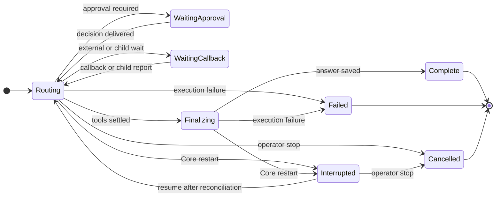

# Execution and restart recovery lifecycle

Status: design inventory, September 22, 2026. The current-state sections describe
the `origin/main` baseline at `a30aa79`. The failure matrix distinguishes
observed defects from scenarios that still require fault-injection tests. The
target lifecycle is a staged design; see the implementation status below.

[Editable FigJam lifecycle board](https://www.figma.com/board/aoQcmstUOUo3n11Cg8YKXf)
contains the current state machines, the observed restart race, a failure map,
and the proposed recovery state machine.

## Scope and state owners

The operator journey starts in a conversation's interrupted-response card after
Core reconnects. A valid recorded result should clear the unknown effect,
preserve the response history, and allow the goal to continue. An effect without
a trustworthy result must stay blocked with an actionable review choice.

| Journey step | Observable invariant | State authority | Proof layer |
| --- | --- | --- | --- |
| Reconnect and select | The same conversation and interrupted response return. | URL identity and Core `ChatSession`/`ChatTurn` | Real Core browser restart |
| Classify effect | A terminal receipt clears only its exact invocation; an uncertain effect remains blocked. | `ToolCall` or `NativeHookExecution` ledger | Core and API fault injection |
| Review and resume | A stale revision reloads current state; one operator decision is recorded without rerunning the effect. | Core turn revision and reconciliation record | Browser and real Core |
| Continue goal | Recovered history and provider call identity survive resume; a graceful stop can continue when all effects are known. | Core `ChatTurn` and `ChatGoal` | Core and real Core |

The recovery card is transient presentation state. The URL selects the session;
Core owns the turn, tool, hook, goal, and child records. Provider streams and
hook processes can outlive a Core stop, so their process state is not an effect
receipt. A browser refresh or reconnect must always reread Core before allowing
a decision. Fork, delete, and revoke do not change recovery ownership and are
outside this first-stage acceptance slice.

Nebula has two supervisors with different contracts. A conversation goal owns a
sequence of provider turns and can have child goals; a provider turn can delegate
to Core-owned subagents. A Mission run uses a separate planner, task graph, and
specialists. They share the tool ledger, but Mission restart currently fails an
API-owned run whereas provider-chat restart parks a turn for possible resume.

| Entity | Durable owner | Current states | Restart action |
| --- | --- | --- | --- |
| Conversation goal | `ChatGoal` | draft, running, paused, blocked, completed, cancelled | Running goal with a claim becomes paused; claim cleared. |
| Provider turn | `ChatTurn` | routing, waiting_approval, waiting_callback, finalizing, complete, failed, cancelled, interrupted | Routing/finalizing turn becomes interrupted; a snapshot lists running tool calls and effectful hooks as unknown. |
| Subagent round | `ChatSubagent` plus its child `ChatTurn` | running, completed, failed, stopped, interrupted | Child waiting on approval/callback is retained; a terminal child is reported; other running children become interrupted and report to parent. |
| Tool call | `ToolCall` ledger | proposed, waiting_approval, approved, running, denied, cancelled, failed, complete | Running calls named in an interrupted provider turn's snapshot require operator reconciliation. The ledger can still receive a terminal result after the snapshot. |
| Native hook | `NativeHookExecution` | running, complete, failed, timed_out, interrupted, reconciled | Running hook is marked interrupted; effectful hooks block turn resume. A late hook result does not replace that interrupted state. |
| Mission run | `AgentRun` plus tasks/attempts/tools | queued, planning, running, waiting_approval, paused, cancelling, cancelled, failed, interrupted, complete | Stale API-owned nonterminal runs are finalized failed and open work is failed. |

The browser's interrupted-response card is a projection of Core's pending turn.
It offers manual tool/hook reconciliation while `recovery_blocked` is true and
Resume Response after that becomes false. The goal's Resume is a separate action
and fails while the interrupted turn still needs recovery.

### Core stop and restart boundary

| Event | Current handling | Evidence limit |
| --- | --- | --- |
| Graceful Core stop | The provider task is cancelled; `_interrupt_turn_for_shutdown` parks an owned routing/finalizing turn. A cancelled native hook's process continues in a worker thread and may report later. | Cancellation of the producer does not undo an already-started external effect. |
| Process crash or forced kill | On startup, Core scans routing/finalizing provider turns and running calls/hooks, then marks the turn interrupted and pauses claimed goals. | The scan is a snapshot; a prior worker or external process may commit a result around that boundary. |
| Subagent startup reconciliation | Running children with waiting approval/callback are retained; terminal child turns are reported; other running children are marked interrupted and reported. | This is a child-record policy, separate from whether the child turn itself has a recoverable effect. |
| Mission startup reconciliation | Stale API-owned nonterminal runs are finalized failed; scheduled queued runs are restored. | Run failure is not evidence that a tool's external effect failed. |

## Current transitions

The tool broker commits a terminal `ToolCall` result before `ChatService`
commits the corresponding `ChatTurn.tool_history` entry. That is a legitimate
two-write window. The live incident crossed it: the turn was interrupted at
15:41:10.909 UTC while call `26059052-dc5e-5d1c-97c9-8c89b971f932` was
running; the call committed a complete result at 15:41:11.247 UTC. The turn
still listed the call as unknown and had no matching history entry. Both manual
reconciliation buttons require a running call, so both reject the recorded
complete state. This evidence proves the stale snapshot, not the cause of the
Core restart.

## Failure inventory

| Case | Status | Consequence today | Required disposition |
| --- | --- | --- | --- |
| Tool reaches complete after turn interruption, before history commit | Observed in live data | Manual recovery is rejected; goal is stuck. | Adopt the durable bounded result into history exactly once; never execute again. |
| Tool reaches failed with a durable result in the same window | Inferred from the same write order | The same stale-snapshot rejection is possible. | Preserve the recorded failure and result; do not ask the operator to guess. |
| Tool fails or is cancelled without a result after an external effect | Possible; needs fault injection | A terminal status may be mistaken for proof that no effect occurred. | Keep effect outcome unknown until verified by an authoritative external receipt or operator review. |
| Tool is still running when the old worker loses its turn claim | Possible; needs fault injection | A later ledger commit can race recovery, as in the observed case. | Fence turn/history commits; classify latest ledger state at each recovery boundary. |
| Multiple tool calls in one provider batch are running at restart | Possible; needs fault injection | Snapshot may require several decisions; stopping currently inspects only the last listed call. | Reconcile every call by stable identity and preserve their original order and replay metadata. |
| Background command already has a results URL | Possible; needs fault injection | Treating an initial complete receipt as a final tool result could resume before its callback. | Distinguish accepted/background from completed effect; retain the callback lease. |
| Effectful hook exits after turn interruption | Code-confirmed path | Hook remains interrupted, even if a late process outcome exists. | Persist a separate late observation; resolve from that evidence without rerun. |
| Read-only hook is interrupted | Code-confirmed path | It can be rerun on resume; output may differ from the first attempt. | Bind each attempt and output to a stable invocation identity; disclose rerun. |
| Child finishes while parent is interrupted or waiting | Possible; needs fault injection | Delivery may be delayed or sent to a later turn. | Durable parent inbox, exactly-once report claim, explicit parent wakeup state. |
| Child turn is recoverable but `ChatSubagent` becomes interrupted at startup | Code-confirmed path | Child report is terminal although its turn may still be resumable. | Define whether the round is resumable; propagate one coherent state to parent. |
| Child result is charged to a goal more than once during competing settle paths | Possible; needs fault injection | Budget may be overstated. | Idempotent charge keyed by child turn and goal. |
| Goal claim is cleared while an old worker still writes a child/tool result | Possible; needs fault injection | Goal and turn can disagree about active work. | Generation/claim fencing on every durable continuation; never fence an external effect by assuming cancellation. |
| Mission fails on restart with a running effect | Code-confirmed policy | `failed` describes the supervisor, not necessarily the effect outcome. | Separate run failure from effect uncertainty; retain an effect review record. |
| Browser holds an old turn revision after another worker reconciles it | Code-confirmed API/UI behavior | Both buttons show a conflict until reload; the current card does not automatically refresh. | On conflict, reload authoritative turn and render its current action. |

The matrix is a set of hypotheses to test, not a claim that every possible
failure has been enumerated.

## Target production contract

1. **One invocation, one durable identity.** Before any side effect, persist an
   intent with owner generation, provider call identity, tool/hook snapshot,
   idempotency contract, and side-effect class. All later observations attach to
   that identity.
2. **Separate execution state from effect outcome.** A stopped worker is not
   proof that an effect failed. `running`, `failed`, or `cancelled` alone cannot
   settle an effect with no receipt.
3. **Make the ledger authoritative.** Derive recovery from the latest durable
   tool/hook/child records; the turn snapshot is a cache of unresolved IDs, not
   an independent fact. Reconcile on startup, state read, and before resume.
4. **Materialize results idempotently.** If a bounded terminal result exists,
   insert or update exactly one turn-history entry with the original provider
   call, order, replay metadata, and artifact references. A repeated recovery
   pass makes no change.
5. **Fence stale workers.** Every turn/goal continuation checks its claim
   generation before committing. Ledger results may arrive later, but can only
   attach to the existing invocation; they cannot reopen or rerun it.
6. **Keep uncertain effects explicit.** Only a verified external query, a
   deterministic idempotent replay contract, or a recorded operator decision
   can clear an unknown effect. Operator decisions remain labelled unverified.
7. **Make parent/child delivery durable.** Each child report has one parent
   inbox item, one delivery acknowledgment, and one budget charge key. Recovery
   can resume a waiting parent or leave a clear paused action.
8. **Keep the UI authoritative.** The recovery card identifies the operation,
   observed outcome and remaining uncertainty; a conflict refreshes state. The
   goal resumes only after its turn and dependent effects are ready.

## Implementation and proof sequence

1. Add a single recovery classifier and receipt projection for provider tool
   calls and hooks. Read latest records after worker quiescence and at resume.
2. Add a transaction or guarded compare-and-set that projects known results
   into turn history. Preserve provider replay metadata and reject malformed
   receipts rather than guessing.
3. Add durable parent/child delivery and idempotent goal charging; separately
   reconcile Mission effect records before calling a run failed.
4. Update the recovery API/UI to return the classified state and refresh after
   revision conflicts. Do not offer completed/failed buttons when the ledger
   already has an outcome.
5. Fault-inject each boundary: before broker execute, during external effect,
   after ledger commit, before turn-history commit, during hook execution, during
   child report, during goal charge, and while a second worker reads state.
   Assert no duplicate side effect, no lost result, and a reachable operator
   action for every unresolved case.

Only the first incident is observed on this host. The remaining entries need
tests and a staged migration before production lifecycle claims can be made.

## Implementation status in this branch

The first recovery stage is implemented in Core and the operator UI: provider
tool intent retains replay identity before execution; read repair validates
terminal v2 receipts, projects them into turn history once, and leaves missing
or malformed results blocked; late native-hook exits are durable observations,
with successful exits projected and failed exits left for review; the recovery
card polls current Core state and refreshes after a revision conflict. Graceful
Core auto resume now classifies late receipts before using the turn revision.
Focused Core/API, hook-process, browser, real-Core LAN restart, and production
build checks are recorded in the test selection receipt. The real-Core restart
journey covers an uncertain hook, while the late tool receipt is exercised at
the durable store/API boundary. Mission effects, durable parent/child delivery
and goal charging, and multi-worker fencing remain subsequent production stages.
Do not call the whole lifecycle complete on the basis of the first stage.
