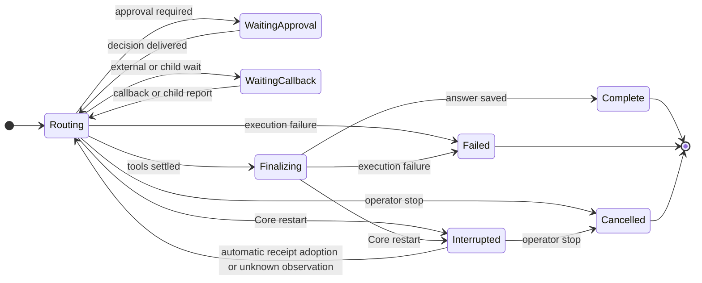

# Execution and restart recovery lifecycle

Status: implemented automatic recovery contract, September 22, 2026. The
incident and failure inventory preserve the former production behavior; the
state owners, target contract, defect closure table, and proof matrix describe
this branch. The matrix distinguishes the observed incident from defects
reproduced with fault injection.

[Editable FigJam lifecycle board](https://www.figma.com/board/aoQcmstUOUo3n11Cg8YKXf)
contains the current state machines, the observed restart race, a failure map,
and the proposed recovery state machine.

## Scope and state owners

The recovery journey starts when Core reconnects. It is system-owned: the
operator does not visit each parent, child, tool, or hook. A valid recorded
result clears only its exact invocation. An outcome that remains unknowable is
carried into supervisor history as explicit uncertainty, the original ledger
slot remains available to a late receipt, identical replay is refused, and the
execution hierarchy resumes automatically.

| Journey step | Observable invariant | State authority | Proof layer |
| --- | --- | --- | --- |
| Reconnect and select | The same conversation and interrupted response return. | URL identity and Core `ChatSession`/`ChatTurn` | Real Core browser restart |
| Classify effect | A terminal receipt clears only its exact invocation; an uncertain effect becomes a non-replayable observation. | `ToolCall` or `NativeHookExecution` ledger | Core and API fault injection |
| Resume hierarchy | Child turn, parent wait, supervisor turn, and goal are reclaimed without an operator action. | Core turn, subagent, inbox, and goal records | Core and browser restart cases |
| Continue goal | Recovered history and provider call identity survive; graceful stop and process restart use the same automatic path. | Core `ChatTurn` and `ChatGoal` | Core and real Core |

The recovery notice is transient presentation state and has no decision
controls. The URL selects the session; Core owns the turn, tool, hook, goal, and
child records. Provider streams and hook processes can outlive a Core stop, so
their process state is not an effect receipt. Fork, delete, and revoke do not
change recovery ownership.

Nebula has two supervisors with different contracts. A conversation goal owns a
sequence of provider turns and can have child goals; a provider turn can delegate
to Core-owned subagents. A Mission run uses a separate planner, task graph, and
specialists. They share the tool ledger and now use the same recovery rule:
adopt a valid receipt, preserve explicit uncertainty, refuse blind replay, and
continue.

| Entity | Durable owner | Current states | Restart action |
| --- | --- | --- | --- |
| Conversation goal | `ChatGoal` | draft, running, paused, blocked, completed, cancelled | The claim is cleared, then the goal is resumed after its turn is reclaimed. |
| Provider turn | `ChatTurn` | routing, waiting_approval, waiting_callback, finalizing, complete, failed, cancelled, interrupted | The turn is fenced, receipts are adopted, unknowns are materialized, and Core starts it again. |
| Subagent round | `ChatSubagent` plus its child `ChatTurn` | running, recovering, completed, failed, stopped, interrupted | The child stays live; Core resumes it, then repairs parent delivery and goal charging idempotently. |
| Tool call | `ToolCall` ledger | proposed, waiting_approval, approved, running, denied, cancelled, failed, complete | The ledger remains authoritative. Missing receipts create an explicit unknown observation without rewriting the call. |
| Native hook | `NativeHookExecution` | running, complete, failed, timed_out, interrupted, reconciled | A late successful receipt is adopted. Remaining uncertainty is preserved as audit evidence and does not block the supervisor. |
| Mission run | `AgentRun` plus tasks/attempts/tools | queued, planning, running, waiting_approval, paused, cancelling, cancelled, failed, interrupted, complete | Core queues the last checkpoint, preserves ambiguous tool rows, and resumes it under the normal concurrency limit. |

The browser may briefly project `recovering`, but it never asks for effect
classification or a Resume click. Normal approvals remain decisions because
they were already required by policy; restart uncertainty itself is not one.

### Core stop and restart boundary

| Event | Current handling | Evidence limit |
| --- | --- | --- |
| Graceful Core stop | The provider task is cancelled; `_interrupt_turn_for_shutdown` parks an owned routing/finalizing turn. A cancelled native hook's process continues in a worker thread and may report later. | Cancellation of the producer does not undo an already-started external effect. |
| Process crash or forced kill | On startup, Core scans routing/finalizing provider turns and running calls/hooks, then marks the turn interrupted and pauses claimed goals. | The scan is a snapshot; a prior worker or external process may commit a result around that boundary. |
| Subagent startup reconciliation | Running children with waiting approval/callback are retained; terminal child turns are reported; other running children are marked interrupted and reported. | This is a child-record policy, separate from whether the child turn itself has a recoverable effect. |
| Mission startup reconciliation | Stale API-owned runs are queued for checkpoint continuation; scheduled queued runs are restored. | Run state and effect outcome remain separate; ambiguous ledger rows refuse the deterministic repeated invocation. |

## Current transitions

The tool broker commits a terminal `ToolCall` result before `ChatService`
commits the corresponding `ChatTurn.tool_history` entry. That is a legitimate
two-write window. The live incident crossed it: the turn was interrupted at
15:41:10.909 UTC while call `26059052-dc5e-5d1c-97c9-8c89b971f932` was
running; the call committed a complete result at 15:41:11.247 UTC. The turn
still listed the call as unknown and had no matching history entry. Both manual
reconciliation buttons require a running call, so both reject the recorded
complete state. This evidence proves the stale snapshot, not the cause of the
Core restart.

## Failure inventory

| Case | Status | Consequence today | Required disposition |
| --- | --- | --- | --- |
| Tool reaches complete after turn interruption, before history commit | Observed in live data | Manual recovery was rejected; goal became stuck. | Adopt the durable bounded result into history exactly once; never execute again. |
| Tool reaches failed with a durable result in the same window | Inferred from the same write order | The same stale-snapshot rejection is possible. | Preserve the recorded failure and result; do not ask the operator to guess. |
| Tool fails or is cancelled without a result after an external effect | Possible; needs fault injection | A terminal status may be mistaken for proof that no effect occurred. | Keep effect outcome unknown until verified by an authoritative external receipt or operator review. |
| Tool is still running when the old worker loses its turn claim | Possible; needs fault injection | A later ledger commit can race recovery, as in the observed case. | Fence turn/history commits; classify latest ledger state at each recovery boundary. |
| Multiple tool calls in one provider batch are running at restart | Possible; needs fault injection | Snapshot may require several decisions; stopping currently inspects only the last listed call. | Reconcile every call by stable identity and preserve their original order and replay metadata. |
| Background command already has a results URL | Possible; needs fault injection | Treating an initial complete receipt as a final tool result could resume before its callback. | Distinguish accepted/background from completed effect; retain the callback lease. |
| Effectful hook exits after turn interruption | Code-confirmed path | Hook remains interrupted, even if a late process outcome exists. | Persist a separate late observation; resolve from that evidence without rerun. |
| Read-only hook is interrupted | Code-confirmed path | It can be rerun on resume; output may differ from the first attempt. | Bind each attempt and output to a stable invocation identity; disclose rerun. |
| Child finishes while parent is interrupted or waiting | Possible; needs fault injection | Delivery may be delayed or sent to a later turn. | Durable parent inbox, exactly-once report claim, explicit parent wakeup state. |
| Child turn is recoverable but `ChatSubagent` becomes interrupted at startup | Code-confirmed path | Child report is terminal although its turn may still be resumable. | Define whether the round is resumable; propagate one coherent state to parent. |
| Child result is charged to a goal more than once during competing settle paths | Possible; needs fault injection | Budget may be overstated. | Idempotent charge keyed by child turn and goal. |
| Goal claim is cleared while an old worker still writes a child/tool result | Possible; needs fault injection | Goal and turn can disagree about active work. | Generation/claim fencing on every durable continuation; never fence an external effect by assuming cancellation. |
| Mission fails on restart with a running effect | Code-confirmed policy | `failed` describes the supervisor, not necessarily the effect outcome. | Separate run failure from effect uncertainty; retain an effect review record. |
| Browser holds an old turn revision after another worker reconciles it | Code-confirmed API/UI behavior | Both buttons show a conflict until reload; the current card does not automatically refresh. | On conflict, reload authoritative turn and render its current action. |

The matrix is a set of hypotheses to test, not a claim that every possible
failure has been enumerated.

## Defect closure in this branch

| ID | Failure boundary | Production disposition | Regression proof |
| --- | --- | --- | --- |
| D1 | Tool receipt commits after the restart snapshot | Core validates and projects the bounded receipt into provider history exactly once. | `test_restart_projects_late_recorded_tool_result_once` |
| D2 | Failed receipt commits in the same window | The recorded failure is projected with its original provider call identity and is never replayed. | The parameterized failed-receipt case in D1 |
| D3 | Failed, cancelled, or complete status has no trustworthy receipt | Core emits an explicit unknown observation, leaves the ledger row unchanged, and blocks identical replay. | `test_restart_keeps_terminal_tool_status_without_a_receipt_unknown` and malformed-receipt coverage |
| D4 | Old worker writes after losing the turn claim | Every provider continuation checks the durable turn and goal claim; late external results can only attach to their existing invocation. | `test_provider_turn_and_goal_have_one_durable_worker_owner` and idempotent intent coverage |
| D5 | Several provider calls are open at stop or restart | Restart classifies every call by stable ID; Stop cancels every nonterminal call in the batch. | `test_cancel_turn_cancels_every_open_call_in_a_provider_batch` and Mission multi-effect coverage |
| D6 | Background command has an accepted receipt and callback lease | The turn remains `waiting_callback`; the accepted receipt is never treated as final output. | `test_approved_background_command_waits_for_its_callback` |
| D7 | Effectful hook exits after the turn is parked | The original hook attempt stores a late observation; successful exits read-repair and uncertain exits continue as explicit audit evidence. | native-hook late-outcome and real-Core restart cases |
| D8 | Read-only hook is interrupted | The exact attempt remains durable, recovery records it as rerunnable, and automatic continuation creates a new attempt. | `test_restart_discloses_read_only_hook_attempt_before_rerun` |
| D9 | Child settles between parent wait and delivery | Terminal children are revisited at startup; deterministic message IDs and transactional posting make delivery repeatable. | parent-wait and late-report restart cases |
| D10 | Child turn needs its own effect recovery | The `ChatSubagent` stays live as `recovering`; Core resumes the child and wakes the parent when delivery settles. | `test_restart_keeps_recoverable_subagent_round_live` plus desktop/mobile UI cases |
| D11 | Competing child settle paths charge usage twice | A durable charge key derived from goal and child turn is committed atomically with usage and the pending marker. | repeated startup reconciliation in `test_goal_picking_up_late_reports_keeps_the_conversation_reasoning_level` |
| D12 | Goal claim clears while old work is still returning | Turn and goal claim generations fence continuation writes; result ledgers remain append-only evidence for the original invocation. | worker-owner and Core auto-resume gate cases |
| D13 | Mission supervisor stops with effects in flight | Core queues the same durable checkpoint, preserves unknown effect IDs as audit decisions, and lets the deterministic ledger key refuse replay. | Mission classifier/checkpoint tests and production LAN Core-restart browser case |
| D14 | Browser presented per-effect recovery actions | Restart recovery is read-only status; Core owns reconciliation and no per-agent clicks are rendered. | desktop/mobile zero-click recovery cases |
| D15 | A background callback producer becomes terminal without posting its result | Core records the effect as unknown and non-replayable in the turn history and tool ledger before it wakes the waiting turn, then settles the child/parent hierarchy through the normal provider path. Periodic reconciliation also closes a stale tool row after a competing wake has already settled the turn. | `test_terminal_background_process_without_callback_becomes_unknown_failure` plus live stale-tree repair |

## Target production contract

1. **One invocation, one durable identity.** Before any side effect, persist an
   intent with owner generation, provider call identity, tool/hook snapshot,
   idempotency contract, and side-effect class. All later observations attach to
   that identity.
2. **Separate execution state from effect outcome.** A stopped worker is not
   proof that an effect failed. `running`, `failed`, or `cancelled` alone cannot
   settle an effect with no receipt.
3. **Make the ledger authoritative.** Derive recovery from the latest durable
   tool/hook/child records; the turn snapshot is a cache of unresolved IDs, not
   an independent fact. Reconcile on startup, state read, and before resume.
4. **Materialize results idempotently.** If a bounded terminal result exists,
   insert or update exactly one turn-history entry with the original provider
   call, order, replay metadata, and artifact references. A repeated recovery
   pass makes no change.
5. **Fence stale workers.** Every turn/goal continuation checks its claim
   generation before committing. Ledger results may arrive later, but can only
   attach to the existing invocation; they cannot reopen or rerun it.
6. **Keep uncertain effects explicit.** A missing receipt becomes an `unknown`
   observation with the original invocation ID. Core does not guess success or
   failure and refuses an identical replay.
7. **Make parent/child delivery durable.** Each child report has one parent
   inbox item, one delivery acknowledgment, and one budget charge key. Recovery
   resumes the child and waiting parent, then charges the goal once.
8. **Keep the UI authoritative.** The recovery notice reports automatic work
   and contains no classification or Resume controls. Core state removes it.
9. **Bound callback leases by producer liveness.** A process callback wait is
   live only while its durable producer is running. Terminal producers without
   callback results become explicit unknown effects; they cannot leave the tool,
   turn, or subagent presented as active.

## Implemented recovery sequence

1. Persist provider intent and execution identity before the effect starts.
2. On shutdown or startup, fence the old worker and classify every tool, hook,
   child, and Mission effect from the latest durable ledger.
3. Project valid terminal receipts into provider history exactly once. Preserve
   callback leases; materialize missing or malformed evidence as explicit
   unknown observations without changing the original ledger row.
4. Repair child delivery and goal charging from deterministic durable keys.
5. Resume each child, parent, provider supervisor, goal, and Mission checkpoint
   automatically under its existing concurrency and budget limits.
6. Render recovery only as transient status and retain the full audit trail.

## Implementation status in this branch

The target recovery contract is implemented across provider turns, hooks,
subagent rounds, goal accounting, Mission runs, and the operator UI. Focused
Core/API fault injection proves the non-replay and idempotency boundaries.
Mocked desktop Chromium, mobile Chromium, and mobile WebKit journeys prove the
zero-click status and responsive states. Real-Core production-bundle journeys on
a non-loopback LAN origin restart Core with an uncertain provider hook and with
an uncertain Mission effect. Physical-device input remains outside this proof;
the mobile evidence is browser emulation and is labelled as such.
