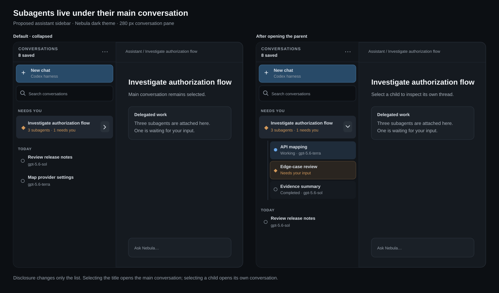

# Nested subagents in the assistant sidebar

[Open the Figma mockup](https://www.figma.com/design/UbP5nXrRdXYbzbYG0gHShq?node-id=2-2)

## Proposed operator behavior

- The conversation list shows each main conversation once. Its subagent sessions sit directly below it and start collapsed.
- The disclosure button toggles the children; the main row still selects the main conversation. A child row selects that child's conversation.
- The collapsed row reports the child count and any child needing attention. A main conversation with a waiting child appears in **Needs you** so the request stays discoverable.
- Opening a child through a link, search result, or restored selection expands its ancestor. Search results show the matching child with its parent context.
- Ordinary conversation branches retain their own navigation treatment. A shared `parentSessionId` alone does not establish that a session is a subagent.
- The same hierarchy appears in the mobile conversation drawer, with disclosure and child actions meeting the 44 px touch target.

## Evidence and implementation boundary

The current sidebar in `ui/src/pages/SessionsPage.tsx` groups a flat session array by activity and date. Subagent sessions already carry `parent_session_id` and a private `subagent_id` marker in Core, while ordinary branched sessions also carry `parent_session_id`. Implementation therefore needs a reliable public discriminator or Core-backed subagent relationship before it can safely nest only subagents. This is a design proposal; no product behavior has changed.
